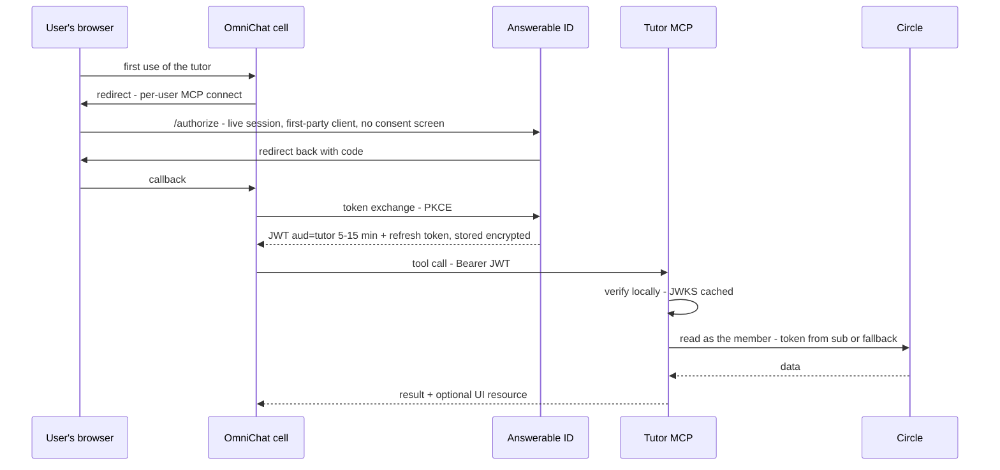
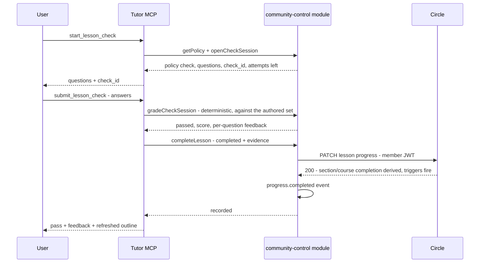

# Tutor design

> **TL;DR**
> - **Decides:** what the tutor does in v1, how a request flows, how it fails, how it runs and is operated.
> - **Rule:** verify the Answerable ID token locally, then act on Circle as the member — the tutor is a thin wrapper around Circle's headless API and holds zero identity logic.
> - **Not here:** tool specs ([`03-tools-and-ui.md`](03-tools-and-ui.md)), Circle/LibreChat facts ([`02-integration-facts.md`](02-integration-facts.md)), schema and credential custody ([`04-community-control.md`](04-community-control.md)).

The tutor is a TypeScript streamable-http MCP server on Bun and Hono, and an **OAuth resource server of [Answerable ID](../../../docs/03-answerable-id.md)**. It is our own MCP wrapper around Circle's headless API — we build the bridge into chat, not the community. v1 callers are the AI agents inside OmniChat cells; clients' own AI tools follow in v1.1 with the same token shape.

## v1 scope

**In:** search community content with citations · browse courses with per-member progress · read lessons in chat · **authored lesson checks** that unlock real Circle completions under per-course policy (`check` | `manual`), fully audited · the three MCP UI surfaces (built last; the first scope to slip) · the community-control module.

**Out (v1.1+, see the [backlog](../../../docs/02-plan.md#backlog)):** external AI tools as callers · posting, comments, DMs, RSVP, notifications · LLM-generated questions (authoring assist only) · `whats_new` · self-service revert (SQL/operator action in v1) · admin endpoints (SQL for now) · Redis caching · horizontal scaling (one replica in v1) · a tailnet listener · a CDN/WAF.

## Identity

The caller presents an Answerable ID JWT (`aud` = the tutor; carries `sub`, org, `email`, `email_verified`; 5–15 min TTL), verified locally against cached JWKS by `packages/auth`. Whether the org may use the tutor at all is Answerable ID's entitlement decision, made before any token exists. Circle access is minted from `sub` (Circle's `sso_user_id`) once Circle SSO points at Answerable ID — **and until that cutover, every member reaches Circle through the audited email-correlation fallback** defined in [`04-community-control.md`](04-community-control.md#minting-a-member-token). That fallback is the primary path for the first client, not an edge case; it is spike-tested (`Q-FALLBACK-PREDICATE`), fails closed on any ambiguity, and is removed when the fleet migration completes.

## Flows

### Connect, then read



`/authorize` and the callback are browser-facing and therefore public; only the token exchange can be tailnet-restricted (`Q-AID-LISTENER`). The connect happens once per user per server; refresh rotates automatically.

### Check, then complete



## Failure modes

| Failure | Behavior | Surfaced as |
| --- | --- | --- |
| Missing / expired / invalid JWT | 401 + `WWW-Authenticate` → the cell refreshes with rotation, or re-runs connect | Transparent on success |
| Wrong audience / org not entitled | 403 (belt-and-braces — Answerable ID wouldn't have issued it) | "Your organization doesn't have the tutor enabled" |
| Not a member (fallback fails closed) | Typed error, no retry | "Your account isn't an Omni Accelerator member yet" |
| Answerable ID outage | Issued tokens keep verifying (stale JWKS served); new tokens/refreshes fail → tool calls degrade within one TTL | "Sign-in service is temporarily unavailable" |
| Postgres outage | Every tool fails fast (state lives there); health check turns red | "The tutor is temporarily unavailable" |
| Circle 401 (member JWT expired) | Re-mint, retry once | Transparent |
| Circle 429 | Honor `Retry-After` inside the 55 s budget; the bucket pre-empts most | "Community is busy; try again in a minute" |
| Per-user or per-org limit hit | `slow_down` | "Slow down — try again in a moment" |
| Projected MAU beyond the cap | `not_available` for members not yet seen this month | "The tutor is at capacity this month" |
| Slow Circle | 10 s per call; ≤ 55 s per tool (under OmniChat's 60 s) | Partial results where sensible |
| Unknown course / lesson | Friendly not-found | Suggest `search_community` / `list_courses` |

## State

The **process** is stateless — identity is the JWT on each request and any replica could serve any call — but the tutor's state lives in **Postgres**: check sessions, encrypted member tokens, member links, policies, check sets, and the domain audit (schema in [`04-community-control.md`](04-community-control.md#schema)). Redis is added later as a read cache for sessions and tokens; nothing in v1 depends on it. An in-progress check is a `check_sessions` row referenced by an opaque `check_id` (uuid, 30-minute expiry); answers live only in `check_sets`, never in transit. Idle disconnects and restarts are non-events because nothing is held in memory that isn't rebuildable from Postgres; content caches are in-process and loss-tolerant.

## Internal layers

| Layer | Responsibility |
| --- | --- |
| Transport | `POST /mcp` (streamable-http via the MCP SDK, mounted on Hono, running on Bun) · `GET /healthz` (checks Postgres) · `GET /.well-known/oauth-protected-resource` (RFC 9728) |
| Auth (`packages/auth`) | Local JWT verification — `iss`, `aud`, `exp`/`nbf`, algorithm allowlist, `kid` — with a JWKS cache that serves stale on refresh failure; exposes `{sub, org, email, email_verified}` |
| Rate limits | Per-`sub` bucket → per-org bucket → the process Circle bucket (4 r/s sustained, burst 20) → `Retry-After` compliance → circuit breaker on repeated 429/5xx |
| Control module | [`04-community-control.md`](04-community-control.md) — Drizzle repositories over the tutor schema |
| Circle client | Generated from `infra/circle-openapi/*.yaml`; Member API as the member, Admin API behind the allowlist; recorded-fixture tests |
| Transforms | TipTap JSON → markdown (unknown nodes → best-effort text + warn) · data → escaped HTML for UI cards |
| Check engine | Session open/grade against `check_sets`; deterministic grading |
| Content caches (in-process) | Catalog 10 min · member sections 2 min · lesson 10 min |
| Observability | pino `{request_id, tool, sub, org, caller, duration, circle_calls, cache_hits, outcome}` — never emails or tokens |

**Runtime:** Bun everywhere — dev, test, and the production image. The MCP SDK's streamable-http transport on Bun is the first thing the skeleton proves (`Q-BUN-MCP-SDK`); if a compatibility gap appears, a Hono-native transport shim replaces the SDK server, not the runtime.

## Testing

Test-first, in the [local environment](../../../docs/02-plan.md#local-environment): unit tests with `bun test`; integration tests against `tutor_test` (Postgres), the Answerable ID stand-in (real signed tokens — the auth middleware's negative matrix runs for real: wrong `iss`, wrong `aud`, expired, `nbf` skew, `alg:none`, unknown `kid`, stale JWKS), and the Circle mocks for request/response shapes; **recorded fixtures** from the Circle spike for behavior (pagination, 401 strings, progress derivation); a TipTap golden set of ≥ 10 real lessons; a governor load test. CI enforces full coverage of our own code; generated clients and config are excluded.

## Secrets

| Secret | Purpose | Custody |
| --- | --- | --- |
| Circle Headless Auth token | Mint member-scoped JWTs | Envelope-encrypted; control module only |
| Circle Admin v2 token | Fallback member search; fallback progress write | Envelope-encrypted; allowlisted; every use audited |
| Envelope master key | Wraps the two Circle credentials and the stored member tokens | Runtime only; never in the database |
| `DATABASE_URL` | The tutor's Postgres | Runtime env |

Four secrets. No LibreChat shared secret, no LLM key, no identity credentials, no signing keys.

## Environment

See [`.env.example`](../../../.env.example) — the local values point at the compose services. `PORT` · `AID_ISSUER` (discovery + JWKS derive from it) · `AID_AUDIENCE` · `DATABASE_URL` · `TEST_DATABASE_URL` · `REDIS_URL` (reserved) · `CIRCLE_MEMBER_API_BASE` · `CIRCLE_ADMIN_API_BASE` · `CIRCLE_HEADLESS_AUTH_BASE` · `CIRCLE_HEADLESS_AUTH_TOKEN` · `CIRCLE_ADMIN_TOKEN` · `ENVELOPE_MASTER_KEY` · `COMMUNITY_BASE_URL` (citation links) · `TUTOR_ORG_DENYLIST` (kill switch) · `MAU_ALLOWANCE` (circuit breaker) · `LOG_LEVEL`.

## Capacity and rate limits

Circle allows 2000 requests per 5 minutes per IP (6.67 r/s). The tutor's bucket holds 4 r/s sustained = 240 Circle calls per minute, community-wide, from the single v1 replica.

| Tool | Circle calls | Cache |
| --- | --- | --- |
| `search_community` | 1 per query | 60 s per identical query |
| `list_courses` (with progress) | 1 + one `/sections` per course (≈ 13 for 12 courses) | Catalog 10 min; per-member progress 2 min |
| `get_course` | 1 | 2 min per member |
| `get_lesson` | 1–2 | 10 min |
| minting | ~1 per active member-hour; fallback lookup once per member ever | `member_tokens` |

So an uncached catalog load costs ~13 calls: roughly **18 fresh catalog loads per minute** community-wide, or 240 searches. Per-`sub` limit: 30 Circle-touching calls/min; per-org: 300/min; both return `slow_down`. Initial values, tuned during dogfood. Pre-warm the catalog before enabling an org.

## Ingress

No CDN or WAF for now: TLS terminates at the host's ingress in front of the single replica. On `/mcp`: no response buffering, compression off for `text/event-stream`, an SSE keepalive comment every 15 s, and an idle timeout above the 55 s tool budget. Proven in the spike (`Q-INGRESS-STREAM`).

## Deployment

One replica, exposed over HTTPS at the ingress (`tutor.answerable.org`); no tailnet listener. Hosting lands with the Answerable ID infrastructure phase.

```yaml
# librechat.yaml — the cell restarts after changes
mcpServers:
  tutor:
    type: streamable-http            # explicit; plain http infers legacy SSE
    url: "https://tutor.answerable.org/mcp"
    title: "Omni Accelerator Tutor"
    timeout: 60000
    serverInstructions: true
    chatMenu: true
    # No auth headers — OAuth is discovered from the server's RFC 9728 metadata.
```

## Rollout and rollback

- **Enable per org** with Answerable ID entitlements rows; **disable instantly** with `TUTOR_ORG_DENYLIST` (an entitlement revoke alone takes up to one token TTL to bite — the tutor does no introspection).
- Adding or removing the server from a cell's `librechat.yaml` restarts that cell — budget restart windows per wave.
- One replica: a deploy is a brief restart; in-flight tool calls fail once and clients retry. Migrations stay backward-compatible.

## Operations

- **Backups:** the tutor's Postgres reuses the existing hourly pipeline (dump → verify → checksum → immutable storage → heartbeat); a restore is rehearsed before the first client.
- **Alerts:** Circle 429 rate · projected MAU vs allowance · fallback correlation failures · wrong-member write incidents (zero tolerance) · completion write failures · JWKS refresh failures · Postgres health · p95 tool latency.
- **On-call:** a named owner during rollout windows; the tutor is not paged outside them in v1.
- **Runbooks:** rotate the Circle tokens · MAU cap breach · wrong-member write (revert, notify, audit) · bulk revert (SQL over `domain_events` + `PATCH`) · seeding policies and check sets (SQL).

## Data protection

Stored: `sub`, org, event metadata, a hash of the correlated email, encrypted member tokens (≤ 1 h life), **hashed answers + per-question correctness** (never raw answers). Retention 24 months by partition drop; erasure by `sub` through a privileged ops role. Logs carry no emails or tokens. Sub-processors: Circle (content, progress) and the hosting provider — no CDN, no LLM in v1. Controller/processor roles for client employee data are confirmed with counsel before the first client; the data map above is the DPIA input.

## Threat model

- **Compromised tutor host or database:** the database holds envelope-encrypted Circle credentials and member tokens — useless without the runtime master key; a compromised host yields the Headless token (member-scoped minting) and the allowlisted admin token → rotate both, revoke, review `domain_events`. Bounded by the allowlist and by Circle enforcing member permissions.
- **Wrong-member write via the fallback:** prevented by the fail-closed predicate; detected by the correlation-failure alert; reverted by runbook.
- **Prompt injection via community content:** content is data, never instructions; HTML-escaped into UI; no write is ever triggered by content.
