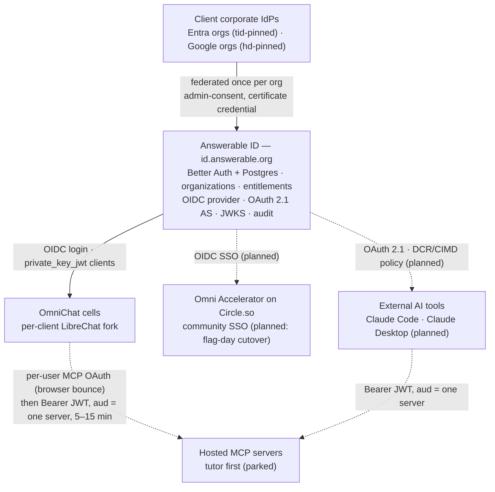

# Architecture

> **TL;DR**
> - **Decides:** how the pieces fit, the golden rule every service obeys, and the stack.
> - **Rule:** Answerable ID mints identity; nothing else does.
> - **Not here:** the design itself ([`03-answerable-id.md`](03-answerable-id.md)) — this page is the map, that document is the territory.

## Landscape

Nothing below is live yet; dashed edges are later phases.

Every consumer verifies Answerable ID's JWTs **locally** against cached JWKS — identity stays off the per-request hot path. An Answerable ID outage blocks new logins, refreshes, and connect flows, not already-issued tokens.

## The golden rule

A token carrying a user's identity is only ever issued when that user's own authentication is presented as evidence: the user present in a browser, or their live token presented by the client that obtained it. Nothing can create a "token for Alice" from Alice's user ID. Machines act as themselves via client-credentials and never receive user-subject tokens. Full statement and consequences: [`03-answerable-id.md` §The golden rule](03-answerable-id.md#the-golden-rule).

## Who holds which secret

| Holder | Secrets |
| --- | --- |
| Answerable ID | Token-signing key (KMS-backed: usable, never extractable); the Entra multi-tenant app's certificate credential — custody rules in [`03-answerable-id.md` §Keys](03-answerable-id.md#keys-and-credential-custody-non-negotiable) |
| OmniChat cells | Their own `private_key_jwt` client credential (one per cell, never shared); users' per-server MCP tokens, encrypted at rest |
| External AI tools | Their own short-lived, audience-bound OAuth tokens (PKCE mandatory) |

## Stack

| Concern | Decision |
| --- | --- |
| Base | **Better Auth** (`@better-auth/oauth-provider` ≥ 1.7.0): organizations, SSO federation, JWT signing, OAuth 2.1 provider; house behavior as custom plugins, never forks |
| Runtime / language | **Bun everywhere, including production**; TypeScript end-to-end |
| HTTP | **Hono** (Better Auth mounted on it) |
| Database | **Postgres 15+** for all state — users, organizations, SSO configs, entitlements, sessions, refresh-token families, consents, client registrations, audit. Drizzle owns the schema; administrative changes use the versioned Hono API under `/api/admin`, never routine direct SQL |
| Cache | **Redis** as a read cache for sessions — later, not used by v1 code |
| Testing | Test-driven; CI enforces full coverage of our own code (`bun test --coverage`) |
| Edge | No CDN/WAF in front of our services for now; TLS terminates at the ingress (the design doc's Cloudflare front is under review — `Q-AID-CDN`) |
| Hosting | Civo London: isolated network, K3s, managed Postgres, admin access via the tailnet ([`03-answerable-id.md` §Hosting](03-answerable-id.md#hosting)) |
| Shared packages | `auth` (JWT verification middleware + client helpers for every consumer), `utils` (logging/redaction, env, crypto, backoff) |

## How the next app or MCP server plugs in

1. Register it as an OIDC/OAuth client of Answerable ID (first-party class, consent skipped) and add its entitlements rows.
2. An MCP server publishes RFC 9728 metadata naming Answerable ID as its authorization server and verifies JWTs locally via `packages/auth`. Per-client-sensitive servers live tailnet-only; shared ones are exposed over HTTPS at the ingress.
3. Import `packages/utils` and `packages/auth`.

Zero client IT involvement — that's the point.
