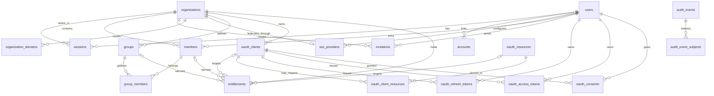

# Answerable ID schema foundation

> **TL;DR**
>
> - **Decides:** the approved first schema, ownership boundaries, identifiers, naming conventions, and invariants.
> - **Rule:** identifiers are application-generated UUIDv7 stored as PostgreSQL `uuid`, with two named exceptions; administrative changes go through the Hono API.
> - **Not here:** the detailed HTTP reference (generated from the public and admin contracts), OIDC grants for apps, and OAuth 2.1 for MCP servers.

**Foundation changes: in progress.** The [enterprise foundation specification](05-id-enterprise-foundation.md) proposes changes to tenant lifecycle, token ownership, entitlements, idempotency and audit history. This page continues to describe the current schema. Known limitations established by the [code review](../reports/answerable-id-feedback-review.md): new durable subject references preserve person-history links after removal/erasure, but legacy missing links cannot be reconstructed and full before/after/effect evidence is unfinished; successful machine issuance now commits an audit fact, while rejected/user-grant coverage remains unfinished. The unsafe member-session aliases have been removed; tenant grant/delegation views still require verified grant contexts.

## Service contract

Answerable ID lives in `apps/id`. Better Auth is mounted at `/auth/*` under `https://id.answerable.org`; the browser login, consent and error pages live in `apps/web` and use `AUTH_PAGES_URL`.

The platform organisation, admin API resource, `platform-admins` staff group and its entitlement are seeded at startup by `src/bootstrap.ts`, awaited by `src/runtime.ts` before serving requests. `PLATFORM_ORGANIZATION_NAME` supplies the organisation name. There are no seed accounts or administration CLIs. Configure the platform domain, SSO provider and first staff member through the admin API using the root bearer.

The admin API lives under `/api/admin/v1`, with versioned Hono routes calling services and grouped query modules:

- **Summaries.** `getPlatformSummary` at `/platform/summary` reports fleet counts and 24-hour sign-ins and denials; `getOrganizationSummary` at `/organizations/{organizationId}/summary` reports organisation counts and seven-day successful sign-ins.
- **Diagnostics.** `diagnoseSignIn` at `…/sign-in-diagnosis?email=` diagnoses database sign-in checks and membership windows; `testSsoProvider` at `…/sso-provider/test` checks outbound discovery and JWKS connectivity without sending credentials.
- **Caller.** `/me` returns the authenticated principal and effective grants, including zero grants.
- **Organisation configuration.** Organisations support list, create, read, update, disable, enable and erase; nested domains and the SSO provider support configuration and reads.
- **People.** Users support list, read, disable, enable, email retirement and erase; members support reads, window changes and removal, with platform-only global user session listing and revocation; `listUsers` and `listMembers` accept exact, lowercase-normalised `email` filters.
- **Access configuration.** Groups and group members, clients (including secret rotation, ownership and resource links), resources and entitlements have administrative routes; `eraseClient` requires removing every referencing entitlement first (`client_has_entitlements` otherwise); `getClient` includes `resources`, `getResource` includes `clients`, and `deleteOrganizationDomain` removes routing without confirmation.
- **Entitlement inventory.** `listAllEntitlements` at `/entitlements?clientId=&resource=` lists recorded grants across organisations with organisation IDs and slugs; status and pagination filters are supported.
- **Access reviews.** `…/members/{memberId}/access` and `…/access?clientId=|resource=` expose effective access.
- **Audit.** Staff read `/audit-events`; organisation admins read `/organizations/{organizationId}/audit-events`. `listUserAuditEvents` at `/users/{userId}/audit-events` finds events by the user as actor or their user, membership or session as target. Audit lists accept `outcome`; platform filters use `organizationId` and `actorId`. Every administrative write is audited. Rejected sign-ins have no organisation, so no per-organisation rejection counts are offered.

The admin API authenticates a Better Auth session cookie with a trusted origin, a bearer JWT for the admin resource, or the root admin secret (a break-glass principal audited as actor `system`/`root`, locked once a human holds `platform:write` unless `ROOT_ADMIN_BREAK_GLASS=true`). Root authenticates with `Authorization: Bearer $ROOT_ADMIN_SECRET`, satisfies every platform scope and records every request as `admin.root_request`, including denied `403 root_locked` attempts. Entitlements grant the six `platform:*` and `org:*` scopes; `x-tier` marks staff-only (`platform`) and organisation-scoped (`tenant`) operations. Tenant admins can read their organisation's configuration and access, change member windows, revoke or reinstate members; self-service configuration writes are **Not yet.** See [`02-plan.md`](02-plan.md).

**Agent contract.** Every operation has an agent-facing description; the document includes parameter, request and response examples. Operation IDs are tool names; `x-kind` is `read`, `write` or `erase`, and `x-scopes` names `{ platform, org? }` authority. The document’s `info.description` explains tiers, scopes and confirmation. Operations marked `erase` require the `confirm` query parameter equal to the target identifier; DELETE requests have no body. Other DELETE operations marked `write`, including domain deletion, need no confirmation. Query names follow fields: `organizationId`, `clientId`, `actorId`.

**Contracts.** `/openapi.json` describes reachable public routes and is snapshotted in `apps/id/openapi.json`; `/api/admin/openapi.json` describes admin routes and is snapshotted in `apps/id/openapi.admin.json`. `bun run openapi:export` from `apps/id` generates both. The web docs publish both references; `/api/admin/docs` also provides interactive admin docs outside production.

Better Auth HTTP routes are deny-by-default. The allowlist exposes `GET /auth/ok`, `POST /auth/sign-in/sso`, `GET /auth/sso/callback`, `GET /auth/get-session`, `POST /auth/sign-out` and `POST /auth/oauth2/token` for `client_credentials` only. The OAuth provider and JWT plugins are registered; other OAuth provider routes are not yet exposed. Better Auth's organisation and client mutation endpoints are internal tools, not the supported administration API. Its client and resource endpoints additionally require a session and privilege hooks that deny by default.

## Entity relationship diagram

## Ownership

| Owner                                    | Tables                                                                                                                                                               | Purpose                                                                                                                    |
| ---------------------------------------- | -------------------------------------------------------------------------------------------------------------------------------------------------------------------- | -------------------------------------------------------------------------------------------------------------------------- |
| Better Auth core and organization plugin | `users`, `sessions`, `accounts`, `verifications`, `organizations`, `members`, `invitations`                                                                          | Authentication, sessions, upstream identities, organization compatibility                                                  |
| Better Auth JWT plugin                   | `jwks`                                                                                                                                                               | Token-signing keys; the row id is the `kid`                                                                                |
| `@better-auth/sso`                       | `sso_providers`                                                                                                                                                      | One upstream OIDC provider configuration bound to each federated organization                                              |
| `@better-auth/oauth-provider`            | `oauth_clients`, `oauth_resources`, `oauth_client_resources`, `oauth_refresh_tokens`, `oauth_access_tokens`, `oauth_consents`, `oauth_client_assertions`             | OIDC provider for our apps and OAuth 2.1 authorization server for MCP servers                                              |
| Answerable                               | `organization_domains`, plus Answerable columns on `accounts` and `sso_providers`, `groups`, `group_members`, `entitlements`, `audit_events`, `audit_event_subjects` | Tenant routing, immutable directory identity, groups, recorded entitlements, admin authorisation policy, and audit records |

The vocabulary is OAuth's. A **client** is anything that requests tokens: an app users log into (an OmniChat cell, Circle) or a tool such as Claude Code. A **resource** is a protected resource the server issues access tokens for, identified by its RFC 8707 resource indicator, which is also the `aud` claim; MCP servers are resources, each with its own token policy (lifetime, allowed scopes, signing key). `oauth_client_resources` is the server-owned link deciding which clients may request tokens for which resources; a registering client can never grant itself one.

`oauth_clients.organization_id` and `authorization_version` are declared server-only plugin fields (`input: false`). The plugin's registration input cannot set them. The admin API sets ownership at creation; the former owner-write route accepts only the unchanged owner and rejects all changes with `ownership_conflict`. The `0005_immutable_security_identity` migration adds UPDATE triggers protecting client instance, public identifier and ownership, and resource instance/public identifier.

App and MCP entitlements are recorded. Enforcement at token grant: **Not yet.** See [`02-plan.md`](02-plan.md). Entitlements to the admin API resource authorise session access today; machine authority uses client scope ceilings and resource links.

A **group** is a set of members within one organization. It either mirrors an upstream directory group (`external_id` set; membership cannot be edited by hand; directory sync is deferred) or is managed in Answerable ID.

An **entitlement** says who may obtain tokens for what, with which scopes. Its principal is the whole organization, one group, or one member. Its target is exactly one of a client (may these people use this app or tool) or a resource (may these people reach this MCP server). Grants are additive: a person is entitled when any active row matches them for the target, and scopes are the union of the matching rows. There are no deny rows; access is removed by disabling a row or leaving a group.

Better Auth columns beyond its own field set (`users.status`, `users.disabled_at`, `users.retired_email`, `accounts.directory_id`, `accounts.directory_user_id`, `organizations.status`, `organizations.disabled_at`, `organizations.updated_at`, `organizations.authorization_version`, `members.valid_from`, `members.valid_until`) are declared as additional fields in `src/auth.ts` and are never client input. Plugin tables keep the plugins' own property names; only physical names follow the conventions below. One consequence: `oauth_client_resources.resource_id` holds the resource identifier, not its row id.

## Conventions

- Physical names are plural `snake_case`; TypeScript properties are `camelCase`.
- Constraint and index names are the ones Drizzle generates: `<table>_pkey`, `<table>_<columns>_unique`, `<table>_<column>_<referenced table>_<column>_fk`, `<table>_<columns>_idx`, `<table>_<rule>_check`. A name is written explicitly, and shortened, only where the generated form would exceed PostgreSQL's 63 characters and be silently truncated. A unique _index_ exists only where a constraint cannot express the rule (partial uniqueness). Pure join tables have a composite primary key and no surrogate id.
- Every timestamp is `timestamptz`. `created_at` defaults to `now()`. `updated_at` is set by Drizzle on every update it issues, including Better Auth's, through `$onUpdate`; there is no timestamp trigger, so raw SQL must set it itself. Token rows always carry an expiry.
- Identifiers are application-generated UUIDv7 (`Bun.randomUUIDv7`), shared by Better Auth, its plugins, and the query modules, with no database default so a raw insert without an id fails. Two exceptions are `text` because Better Auth computes the id itself as a digest: `verifications.id` (reservation locks) and `oauth_client_assertions.id` (single-use `private_key_jwt` assertion ids, where a replay collides on the primary key). Re-check for computed ids (`forceAllowId` in the Better Auth sources) whenever a plugin is added.
- Each vocabulary lives once in `src/db/schema/vocabulary.ts`. The Drizzle column type, the CHECK constraint, and the Better Auth field type all derive from that list.
- Every `status` column is CHECK-constrained. `users` and `organizations` also carry `disabled_at`, which is set exactly when the status is `disabled`, because those two gate login and the offboarding SLA. Plugin tables use the plugins' own `disabled` flags. Deletion is erasure: cascades exist for erasure; normal offboarding is `disabled`.

## Invariants

- **Audit events** are append-only: application code never updates or deletes rows. Organisation erasure preserves `organization_id`; retained entity identifiers do not reference live rows. `target_id` keeps erased ids as text, and durable subject references support entity history after erasure. Actor (`user`, `client`, `system`) and outcome (`success`, `failure`, `denied`) vocabularies are CHECK-constrained; `denied` means an authenticated principal was refused by authorisation. Authentication records `auth.signin.succeeded`, `auth.signin.rejected` and `auth.signout`.
- User emails are unique, trimmed, and lowercase. A disabled user has `disabled_at`; other states do not.
- A retired email exists only while the user is disabled. The login email is `<user id>@retired.invalid` if and only if `retired_email` is set; retirement is terminal.
- External accounts are unique by `(issuer, account_id)`, matching Better Auth 1.7's issuer-scoped account keys. When present, `directory_user_id` is also unique per issuer; `directory_id` stores Entra `tid` or Google `hd`, while `directory_user_id` stores Entra `oid` or the provider `sub`.
- Each SSO provider has a globally unique stable `provider_id`, conventionally the organization slug, and each organization has at most one provider row. Its organization is required and cascades on erasure; its optional configuring user is detached on erasure. Provider domains use the same normalized-host grammar as organization domains.
- Organization slugs are unique and match `^[a-z0-9]+(-[a-z0-9]+)*$`, the Omni-Weaver tenant ID grammar. Better Auth itself only checks that a slug is non-empty. Group slugs follow the same grammar and are unique per organization.
- Membership is unique by `(organization_id, user_id)`. `(organization_id, id)` is also unique on `members` and on `groups` so group membership and entitlements can reference both at once. `members.role` is Better Auth state, may hold a comma-separated list, and confers no authority in Answerable ID; entitlements do.
- A group's `external_id` is unique per organization when set. Group membership is keyed by `(group_id, member_id)`; both composite foreign keys carry the organization, so a group cannot contain another organization's member. Removing a member removes their group memberships and member-specific grants; removing a group removes its memberships and grants.
- Domains are stored lowercase as ASCII host names with at least two labels (internationalized names as punycode). A domain has at most one **active** organization and appears at most once per organization. Moving a domain means disabling or deleting the old row, then adding the new one; `findOrganizationByDomain` therefore returns one organization or null, and ambiguity cannot exist in the data.
- An entitlement has at most one of `member_id` and `group_id`, and exactly one of `client_id` and `resource`. It is unique by `(organization_id, member_id, group_id, client_id, resource)` with `NULLS NOT DISTINCT`, so the organization-wide row is unique too. Scopes are non-empty and contain no empty string. Member- and group-specific rows use composite foreign keys with the organization, so they cannot point across organizations. A client or resource referenced by an entitlement cannot be deleted; disable it instead.
- Client ids and resource identifiers are globally unique. Deleting a client removes its links, tokens, and consents; deleting a resource removes its links. Sessions detach from tokens (`set null`); users take their tokens and consents with them.
- Client ownership is nullable and deletion-restricted. Administrative client creation requires an owner for machine clients; the admin API rejects unowned machine principals. The token endpoint also rejects unowned clients and clients whose organisation is inactive. `authorization_version` is a positive integer, initially 1; a database trigger advances it on disable or changes to the secret digest, JWK set, JWK URL or authentication method. The version cannot decrease. Resource custom claims have a database constraint excluding the five machine identity claim names.
- Members, group memberships, and entitlements have nullable effective windows with `valid_from < valid_until`. Windows are half-open: `valid_from` is inclusive, `valid_until` is exclusive, and NULL is unbounded. A row is effective when its status is active where present and `now()` is inside the window.
- `sessions.active_organization_id` is organization-plugin state for Better Auth's own routes. It is never an authorization input; the token's organization comes from membership.
- `invitations` stays because the organization plugin deletes members and invitations when an organization is deleted through it. Its `status` is constrained to Better Auth's vocabulary. Invitations are not an Answerable administrative capability in this milestone.

## Lifecycle values

| Entity                                              | Values                                                                      |
| --------------------------------------------------- | --------------------------------------------------------------------------- |
| User status                                         | `inert`, `active`, `disabled`                                               |
| Organization, domain, group, and entitlement status | `active`, `disabled`                                                        |
| Invitation status (Better Auth)                     | `pending`, `accepted`, `rejected`, `canceled`                               |
| Client and resource                                 | the plugins' `disabled` flag                                                |
| Effective windows                                   | nullable `valid_from` / `valid_until`; half-open, NULL unbounded            |
| Email retirement                                    | terminal transition after `disabled`                                        |
| Audit                                               | actor: `user`, `client`, `system` · outcome: `success`, `failure`, `denied` |

`inert` means imported and not yet bound to an upstream identity. The SSO user-resolution hook owns activation and every federation write inside the login transaction; Better Auth's implicit create-user path is unreachable. A new verified identity is created active, while an imported identity becomes active only when its immutable directory key matches. The Entra placeholder account uses `account_id = 'import:<oid>'` and `directory_user_id = <oid>` (with `directory_id = tid`) until first login rewrites `account_id` to the verified `sub`.

`retired.invalid` is never a login email or an organization domain.

## How the policy reads the schema

For implemented admin access checks, the policy applies `isEffective` to the member, group-membership, and entitlement rows. For a session, it collects the member's effective groups and entitlements for the admin resource, where the principal is the organisation, one of those groups, or the member. Enforcement at every app or MCP token grant: **Not yet.** See [`02-plan.md`](02-plan.md).

`effectiveGrants` in `src/db/queries/grants.ts` implements this computation for resource targets and returns per-organisation scope unions. The admin API’s access views (`…/members/{memberId}/access` and `…/access?clientId=|resource=`) expose this computation for access reviews.

Machine issuance requires one resource, uses the per-client scope ceiling and `oauth_client_resources`, and rejects clients without an active owning organisation. JWTs bind `client_instance`, `organization_id`, `authorization_version` and `subject_type=client`. The admin verifier requires matching current instance, owner and version as well as issuer, audience and expiry. Its current-state query also requires an enabled resource and client-resource link, and effective scopes are intersected with the resource ceiling; old tokens lacking these claims are rejected. This prevents an old token inheriting a different owner or recreated client instance. Administrative and raw SQL ownership changes are rejected. Migration `0006_security_identifier_reservations` reserves every current client/resource identifier and instance UUID, then reserves new inserts atomically through triggers. The three-column `security_identifiers` table has no secrets or live-record foreign keys; its rows survive erasure and reject UPDATE/DELETE. A rolled-back creation leaves no reservation. The migration cannot reconstruct identifiers erased before it was introduced; inventory historical consumers before cutover. `system_bindings` persists the platform organisation/resource/group UUIDs with restrictive foreign keys and an immutable-row trigger. Bootstrap creates this once and refuses unbound existing names. Existing deployments import explicitly reviewed UUIDs with `scripts/bind-system.ts`; no name-based migration is performed. Session and machine grants expose `isPlatform` from this binding; authorisation, root lockout and platform summaries no longer compare platform slugs. Tenant capability ceilings and complete grant audit remain in the [foundation specification](05-id-enterprise-foundation.md#3-immutable-credentials-and-token-policy).

## Durable audit subjects

Migration 0008 removes the live organisation foreign key from `audit_events.organization_id`. The tenant UUID survives erasure, including the erasure event itself. An AFTER INSERT trigger writes actor/target subjects and the related user for member, group-member and session events in the same statement. References have no foreign keys to live people, memberships or tenants; a subject-write failure rolls back the event.

Person-history queries use `audit_event_subjects`, not current memberships. Retained user/organisation history is queryable after erasure with the existing audit permissions; an unknown UUID with neither live data nor history still returns `not_found`. Legacy references derived from retained event fields or current memberships are marked `legacy_derived`. Missing historical links and tenant IDs previously nulled by erasure are not invented. This establishes UUID correlation, not retained names or a complete access-removal manifest.

Migration 0013 adds an indexed nullable operation_id with a deferred foreign key to the permanent operation journal. Journalled client mutations insert their audit facts before the completed journal row; the foreign key checks at commit, so neither dangling links nor their transaction's data changes can survive. Existing events keep null operation links. schema_version is 0 for pre-migration rows and defaults to 1 for new envelopes; it does not certify that every action has a complete typed payload. A migration test executes the committed SQL against legacy rows and verifies those defaults without inventing links.

Client creation and configuration updates now record allowlisted security snapshots. Raw JWK configuration, credential digests and secrets are omitted. requestedFields names the submitted patch fields, without claiming each value changed. Rotation records before/after authorisation versions and whether the credential digest changed. These events retain the owning tenant UUID. Platform and organisation audit queries accept operationId. Full policy/effect manifests and the remaining action payloads are still in the foundation specification.

## Runtime database permissions

Migration 0009 makes the audit-subject and identifier-reservation trigger functions owner-executed with their fixed search paths. Direct function execution is revoked. `scripts/configure-runtime-role.ts` provisions a separate non-owner role using `DATABASE_MIGRATION_URL`. It grants ordinary application writes while denying audit UPDATE/DELETE, direct subject/reservation writes, binding UPDATE/DELETE, table TRUNCATE and schema CREATE. Reapply provisioning after migrations add tables.

Production startup runs `assertRuntimeRole` before bootstrap or listening. It rejects privileged role attributes, role memberships, ownership and permissions that would allow protected evidence to be changed. Integration tests use an actual separate login to prove bootstrap, token issuance and admin reads succeed, while audit mutation, subject forgery, schema writes and owner-role switching fail. The full suite otherwise uses the disposable test database's owner role. These controls do not establish tenant row isolation or protection against database administrators. Setup is documented in [the ID README](../apps/id/README.md#database-roles).

## Completed administrative operations

Migration 0010 adds `admin_operations`, with a unique key over immutable actor instance, authority scope, operation name and SHA-256 key digest. It stores the canonical input fingerprint, applied/no-op outcome, status and result reference. It contains no live-entity foreign keys, request bodies, response bodies or secrets. Completed rows reject UPDATE/DELETE; runtime permissions also deny TRUNCATE. Reservations do not expire.

The service primitive takes a transaction advisory lock for the scoped key, rechecks authority, then compares an existing fingerprint or executes the mutation and inserts its completed record. Mutation, audit and journal insertion share one transaction. Immediate lock contention is a retryable result rather than a persisted running state. Domain input normalisation and lock ordering remain the caller's responsibility. HTTP status reads now restrict the tenant projection to its original actor; platform readers have audit access. Unknown, foreign-actor and foreign-tenant operations return the same not_found response. Migration 0011 adds an immutable replay expiry to the reservation and a separate `admin_operation_results` ciphertext row. The JOSE JWE header binds encryption to the operation ID and versioned key ID. Result insertion shares the mutation/journal transaction; encryption failure rolls everything back. The runtime cannot update/delete/truncate ciphertext. The internal helper recovers encrypted JSON for up to 24 hours for secret responses or seven days for ordinary responses. Expired or missing payloads never release the operation key. Status reads distinguish reference-only records, available stored payloads and expired/missing payloads without decrypting them. Availability does not prove that the deployment still has the decryption key.

Migration 0012 adds `purge_operation_results`, a fixed-search-path SECURITY DEFINER function restricted to a separate retention role. It deletes at most 1,000 expired ciphertext rows per call, using database time and skipping locked rows. An audit event with the exact removed IDs commits in the same statement. Failure restores the ciphertext; fresh rows and permanent operation keys remain. The maintenance role cannot read or mutate tables directly, and the runtime cannot execute the purge function. `OPERATION_REPLAY_CONFIG` validates dedicated versioned deployment keys without including their values in errors.

Client creation and rotation now use the journal with required keys and encrypted 24-hour recovery. Authority is re-evaluated inside the transaction; user/session rows are held with shared locks. A common ordering protocol for all grant/revocation writes remains F4 work, so these checks do not establish the complete concurrency boundary. Client PATCH now requires a revision precondition and journal key, with seven-day encrypted recovery. Enable/disable, owner verification, link/unlink and erasure also use the journal with seven-day recovery. State/link noops preserve revisions, and replay does not require the erased client row. All resource mutations also use the journal with seven-day recovery and resource PATCH requires a revision precondition. Other mutation families, production key provisioning/purge scheduling and revisions on remaining configuration are not implemented yet. Setup is documented in [the ID README](../apps/id/README.md#replay-keys-and-retention).

## Contract test

`src/db/schema.integration.test.ts` freezes the PostgreSQL catalog: every column with its type, nullability, and default; every constraint with its definition; every index. It also drives Better Auth and the OAuth provider through their own APIs against the schema. A schema change is a deliberate edit to that snapshot, reviewed against this document.

## Deferred

**Not yet.** The capabilities below remain in [`02-plan.md`](02-plan.md).

- **Group sync from directories.** The federation milestone maps the upstream `groups` claim (Entra object ids, Google groups) onto `groups.external_id` and refreshes `group_members` at login; SCIM comes later.
- **Upstream IdP token cutover and recovery.** Supported account transforms now encrypt `accounts.access_token`, `refresh_token`, and `id_token` using a dedicated versioned `UPSTREAM_TOKEN_SECRETS` ring. New writes use its first version; reads require the matching retained key and reject plaintext, bare-hex legacy encryption and corruption. Null imported tokens remain valid. The provider's separate access/refresh encryption flag is disabled to avoid double encryption. Migration 0037 clears pre-cutover credentials and expiry fields in one audited transaction, preserving identity bindings, sessions and Answerable grants. Its receipt prevents reruns from clearing new credentials; process-kill and native SSO tests cover recovery. A guarded local `test:restore` rehearsal now proves mixed-key recovery, missing-key refusal, restored session/receipt identity and fresh SSO through the restricted runtime role. **Not yet:** external-consumer inventory, representative-volume migration, production disaster recovery and key provisioning. Complete the [custody contract](../reports/answerable-id-upstream-token-custody.md) before real logins or existing-database deployment. The separate signing-key milestone still decides how `jwks.private_key` moves to a KMS or a separate key-encryption key.
- **Domain verification** (`verified_at`). Domains are configured by staff through the admin API; verification becomes mandatory the day organization admins can add their own.
- An index on `users.retired_email`.
- A CHECK excluding `.invalid` from `organization_domains`.
- OIDC consent grants, legacy-import tooling, SCIM, DPoP, token-exchange, outbox, and Redis tables do not exist yet. The browser login, consent and error pages exist; OIDC grants for apps are not yet available.

Migrations live in `apps/id/drizzle` and are generated with `bun run db:generate` from `apps/id`. The disposable test database is built from the committed migrations; a drift test fails when the schema and migrations disagree.

## Client configuration revisions

Migration 0014 adds `oauth_clients.revision`, default 1 with a positive check. A BEFORE UPDATE trigger rejects caller-supplied revision changes and increments the revision when the row changes, after the existing identity/version trigger. Resource-link insert/delete and changes to its client/resource touch affected parent clients in identifier order. Metadata-only link changes do not change the public resource list. Duplicate inserts do not advance revisions; explicit link removals do. Resource deletion now requires unlinking first (migration 0018). Client GET holds a shared parent lock while reading links and sorts identifiers. PATCH locks the parent and checks the instance/revision before mutation, inside the operation transaction; committed replay precedes that check. An unchanged patch skips UPDATE and records explicit unchanged audit evidence. This is client configuration concurrency control, not the unfinished common grant/revocation ordering protocol.

## Resource configuration revisions

Migration 0015 adds positive `oauth_resources.revision` and reuses `protect_configuration_revision`. The link trigger now touches both client and resource endpoints when visible links change; client erasure therefore advances surviving linked resources. Duplicate links and metadata-only link changes do not advance either revision. Resource GET holds a shared row lock while reading a sorted client list. This revision describes configuration concurrency, not issuance policyVersion. Resource mutations use operation-linked selected before/after audit snapshots; global resources have no owning-tenant attribution. Complete deletion-effect manifests and common issuance/revocation lock ordering remain unfinished.

## Membership revocation

Migration 0016 adds `members.status` (`active` or `revoked`) and `revoked_at`, with a check requiring a time exactly when revoked. Existing members default active. A database trigger protects membership ID, user and organisation from reassignment. All queries using `isEffective(members)` now reject revoked rows; the explicit summary predicate also checks status. Member API projections retain the existing global user `status` and add `membershipStatus` and `revokedAt` to distinguish the two.

Member removal updates this state instead of deleting the identity. Direct member entitlements and group memberships are deleted in the same transaction; audit includes the previous effective access and returned deleted rows. Revoked members cannot receive new direct assignments or group membership through the services. Reinstatement is explicit and does not recreate deleted assignments. Federation checks revoked state before continuing or activating an imported identity. This does not yet implement tenant grant contexts, tenant-local session routes or the full concurrent issuance boundary; member mutation-key replay is now implemented. Historical deleted memberships require a reviewed offboarding inventory; this migration cannot invent their identity or revocation state.

## Organisation authorization version

Migration 0017 adds a positive, monotonic `organizations.authorization_version`, initially 1. A database trigger advances it on active-to-disabled transitions; re-enable does not reset it. This is an authorization epoch, distinct from configuration revisions and client credential versions. Machine issuance includes `organization_authorization_version`; admin authentication and journal authority compare it with current owner state. Missing or stale claims fail validation, so pre-migration machine JWTs must be reissued.

Organisation disable updates status/epoch, revokes stored machine access tokens for owned clients, and audits actual token IDs plus before/after state atomically. Global browser sessions and user grants without a verified tenant context are preserved. User grant tenant attribution, tenant session routes and the complete concurrent issuance/revocation protocol remain Not yet; client ownership must not substitute for a user's tenant context.

## Global session boundary

The former member-session GET/DELETE routes and their service/query aliases are removed. They mapped tenant membership to a global user and exposed or revoked every session for that person. Organisation summaries no longer return the global `sessions.active` count. Platform summaries and `/users/{userId}/sessions` retain global semantics and platform authorization. Tenant grant/delegation views are Not yet; user OAuth remains closed until verified tenant grant contexts and policy enforcement are implemented.

## Authentication transaction boundary

The supported Drizzle adapter is wrapped at its transaction method so domain policy can obtain the same active SQL executor used by Better Auth. This is scoped to the transaction adapter object and removed in `finally`; a stale or unknown adapter cannot obtain a database handle.

Machine issuance takes shared organisation, client and resource locks, in that order, before provider policy reads. It compares the authenticated instance/credential version and refreshes client configuration under lock. Lifecycle services take exclusive locks on those same rows. Tests observe the actual PostgreSQL blocking relationship: issuance first forces disable to wait, while disable first rejects issuance. Re-enable does not restore the old token version. Two issuances can hold shared locks concurrently and a different tenant can be changed. Normal JWT issuance is stateless; stored-token revocation counts do not count all signed JWTs.

This is partial F4 ordering. Resource/capability/assignment writers, bounded waits, production latency measurement and the complete user-grant protocol remain unfinished. Shared locks currently span local signing and commit; remote consumers still need expiry or online current-state validation.

**Implemented slice: bounded machine issuance lock waits.** Issuance applies transaction-local PostgreSQL `lock_timeout = '2s'`. Lock timeout errors roll back and return OAuth `503 temporarily_unavailable` with `Retry-After: 1`; other failures are not relabelled as contention. Integration tests prove no transaction marker survives, a retry succeeds after the blocking writer releases, and no timeout setting leaks to any pooled connection. The bound is per lock wait, not an end-to-end request deadline. Client assertions remain consumed outside issuance and must be regenerated for retries. Administrative transaction waits, resource/capability ordering and total request budgets remain separate unfinished work.

## Resource link deletion boundary

Migration 0018 changes `oauth_client_resources_resource_id_fk` from ON DELETE CASCADE to ON DELETE RESTRICT. Resource erasure refuses existing client links with `resource_has_clients`; raw SQL deletion is also rejected. Clients must be explicitly unlinked first, producing their normal journal/audit facts and revision changes. Client erasure retains its link cascade. This removes the reverse resource-to-client update path during resource erasure; issuance and link writers use client-then-resource locks.

The provider reads resource policy after shared locks are held, so a policy update either commits first and is used for the request, or waits until issuance commits. Scope and TTL regressions cover both current-state evaluation and later requests. Failed erasure leaves no journal reservation; after unlinking, the same command key can commit and replay normally. This does not complete capability/assignment ordering or user-grant contexts.

## Machine issuance evidence

Successful issuance adds `oauth.token.issued` to the existing audit table in the same transaction as policy/extension writes. The actor is the reserved public client ID, tenant attribution is the immutable organisation UUID, and the target is the token jti (`access_token`). Existing subject capture retains actor/target references. Allowlisted data records client/resource instance UUIDs and configuration revisions, current scope ceilings, requested/granted scopes, client/organisation authorization versions and JWT iat/exp as Unix seconds. Neither the bearer token nor arbitrary request metadata is stored.

Audit storage failure rolls back before returning an OAuth 503 response. Correlation IDs do not deduplicate OAuth: repeated successful requests create distinct jtis and events with no administrative operation ID. The event proves commitment, not delivery or remote use. Complete denied-grant records, capability/assignment contributions, user-grant evidence and operational monitoring remain unfinished.

## Member command receipts

Member update, removal and reinstatement now use the existing operation/result tables; no new migration is needed. Receipt authority scope is `tenant:<organisation UUID>` for both tenant and platform actors acting on that tenant. The canonical input includes the target member and normalised patch, and ordinary response ciphertext expires after seven days while the minimal key reservation remains. The journal passes the authorised tenant transaction context directly to the mutation callback and commits the member audit fact with the receipt. New-key unchanged state records an operation noop; same-key recovery emits no second mutation fact. Migration 0019 now adds the server-controlled positive member revision and PATCH preconditions. The stable getMemberConfiguration projection supplies its ETag; rich profile/access projections do not. PATCH locks the member row before comparing the expected instance/revision. Revocation and reinstatement also advance the revision; unchanged row values preserve it.

## Domain command receipts

Domain create, enable, disable and delete use the same journal with platform authority and seven-day response recovery. The fingerprint includes the organisation UUID and normalised creation input or domain row UUID. Replaying deletion does not require the live row. A new enable/disable command whose desired state already holds records a noop without updating timestamps. Domain facts include allowlisted identity and before/after routing state; mutation, fact and receipt commit atomically. Domain ownership constraints still apply to new commands; replay is historical recovery, not a new assignment. No new table, DNS verification or tenant write delegation is introduced.

## Organisation command receipts

Organisation create, PATCH, enable, disable and erase use the existing platform-scoped journal and seven-day recovery. No new schema is required for this adoption. Retries recover the original result, including after erasure. New-key unchanged PATCH or lifecycle state records a noop without updating timestamps. No-op disable skips epoch advancement and machine-token revocation. Audit captures allowlisted configuration before/after; arbitrary metadata is not copied, and updates record whether it changed. Erasure currently records the organisation snapshot, not a complete cascade manifest. Full tenant user-grant cleanup remains pending. Migration 0020 adds the organisation configuration revision and reuses protect_configuration_revision. The complete stored-row GET supplies a strong ETag; PATCH requires that expected instance/revision under the existing organisation lock. The expected revision is part of the journal fingerprint, with replay preceding mutation/precondition evaluation. Audit configuration snapshots include the revision. Raw SQL and lifecycle changes also advance it; identical row updates preserve it.

## Keyed command fingerprints

The existing fingerprint text column now stores `hmac-v1.<base64url key ID>.<hex MAC>` for new commands with encrypted recovery. HMAC-SHA-256 binds canonical input to actor, authority scope, operation name and key digest. A domain-separated key derived from the replay master key separates MAC use from AES encryption. The original key ID controls retry verification after rotation. Existing 64-character SHA-256 receipts retain legacy verification; no receipt is rewritten. Reference-only internal commands retain SHA-256 and are not suitable for secret-bearing input.

After current authority checks, expired or missing payloads return 410 before fingerprint comparison. This keeps permanent key reservations effective after old key retirement; changed-input retries to an expired result also return 410. Missing keys for a live result return 503 without executing it. The public status projection continues to omit fingerprints and secrets. No schema migration, key provisioning or maintenance worker is added.

## SSO command receipts

SSO PUT/delete use the existing platform journal and keyed fingerprints, with seven-day redacted-response recovery. No migration is needed. Omitted clientSecret retains the stored value during a new PUT, but a retry returns the original response without applying the instruction again. Effective configuration equality compares parsed JSON after defaults/secret preservation, so object key order does not cause a write. PUT reads the provider under a row lock after locking its organisation. Noops preserve timestamps. Audit captures the explicit redacted projection and credential-change flag. Delete uses its returned deleted row for the snapshot and immutable result reference; replay does not affect a recreated row. Migration 0021 adds a server-controlled revision using protect_configuration_revision. Redacted GET and PUT return revision/ETag. PUT requires If-None-Match: * for creation or If-Match for replacement, with exactly one header. The expected absence or instance/revision is checked under organisation/provider locks inside the journal mutation; it is fingerprinted and replay precedes the check. Missing provider on replacement and existing provider on creation return 412. Secret and raw row changes advance the revision. In-flight grant invalidation remains pending.

## Group command receipts

The seven group mutations use the existing platform journal and seven-day recovery; no schema migration is needed. Configuration/lifecycle noops preserve timestamps, and membership noops skip the upsert. Omitted window fields preserve prior values. Reads for mutation lock the group and relevant assignment after the organisation lock. Audit captures allowlisted configuration or assignment before/after values; group erasure still lacks a full cascade manifest. Assignment result references use the composite `<group UUID>:<member UUID>`. Replay is historical recovery and cannot remove a later re-added assignment. Migration 0022 adds a positive server-controlled group configuration revision with the existing trigger. getGroup returns its ETag and PATCH requires If-Match under the organisation/group locks. The expectation is fingerprinted, and replay precedes the precondition check. Lifecycle and raw group-row changes invalidate old tags; noops preserve them. Individual assignment-window revisions and HTTP preconditions are now implemented; complete policy writer ordering remains pending.

### Group assignment identities

Migration 0023 preserves the composite primary key `(group_id, member_id)` and adds a unique, non-null UUID `id` and positive integer `revision`. The migration backfills UUIDv7 values for existing rows without changing ownership, validity windows or creation times. Runtime inserts require application-generated IDs. An identity trigger rejects changes to the UUID, organisation, group or member; the existing configuration revision trigger rejects caller-controlled revisions and advances on changed rows. A no-op upsert preserves both values. Deletion and recreation through the query layer creates a new UUID even when the pair is unchanged.

Assignment mutation responses and allowlisted audit snapshots expose identity/revision. getGroupMember now provides its stored-row ETag; PUT requires expected absence or the assignment instance/revision. The journal fingerprints expected state and replays before its locked check. A parent group revision does not change with assignment windows, avoiding conflicts between unrelated assignments. Integration tests exercise update/recreation, raw SQL guards and a populated-row migration rehearsal rolled back after inspection.

### Entitlement command recovery

The five entitlement mutations now use the existing platform journal and seven-day encrypted response recovery. No migration is needed. Scope inputs are deduplicated/sorted for fingerprints and writes; comparisons treat existing scope arrays as sets. Unchanged scopes/windows or lifecycle state skip writes and record explicit noop outcomes. The query optionally locks the entitlement row after the organisation lock, and audit captures allowlisted principal/target/scopes/status/windows before and after each change. Mutation, audit and receipt commit atomically; removed records can be recovered historically without recreation. PATCH revision checks are now implemented; capability attribution and complete policy writer ordering remain unfinished.

### Entitlement revisions

Migration 0024 adds a positive `revision` to entitlement rows with the existing database configuration guard. getEntitlement supplies its stored-row ETag, and PATCH requires If-Match with the operation key. The expected immutable instance/revision participates in the fingerprint and is checked after historical replay under organisation/entitlement locks. Noops preserve revisions; lifecycle and raw SQL changes advance them. Integration tests cover tamper rejection, stale/lifecycle/raw edits, competing commands, replay and a recreated principal/target pair with a new entitlement UUID. This completes the current HTTP replacement-precondition inventory, not full tenant/policy isolation.

### Global session command recovery

The two global session commands use the existing platform journal with explicit platform:users current-authority checks and seven-day result recovery. No schema migration is added. deleteUserSessionIds returns actual sorted deleted IDs; the existing count helper delegates to it for callers that only need a count. Single revocation records a limited before snapshot and token counts, omitting tokens/IP/user-agent. Revoke-all facts correctly target the user rather than treating its UUID as a session ID, and include deleted session IDs. New empty revoke-all commands record noop; token-only revocation records applied. Replays do not act on sessions created after the original commit. Full token-ID effects, tenant context and concurrent issuance ordering remain pending.

### Global user command recovery

All four user commands now use the existing platform journal and seven-day encrypted response recovery. Lifecycle commands retain platform:users and eraseUser retains platform:write. Equivalent new-key lifecycle requests record noops without repeating status writes or disable cleanup. Existing inert/retired-email restrictions remain. New audit snapshots contain only user UUID, status, disabled time and an email-retired flag; disable includes actual deleted session IDs and token counts. Retirement no longer copies the old email into new immutable facts. Erasure records limited before/after state, not its complete cascade manifest.

Replay preserves the existing user response shape in encrypted, expiring payloads, including names/email fields after operational erasure. UUID audit attribution is accepted; no separate named recovery is required. Physical cleanup and its duration are deferred. Retained identifying rows, historical audit payloads and operational backup/key controls remain separate concerns. The runtime does not rewrite historical facts or claim immediate deletion of all identifying copies. All 46 current administrative mutation routes now have key/recovery contracts; this does not complete typed tenant boundaries, grant ordering or full effect manifests.

### Own operation status

The /me/operations/{operationId} read uses the immutable journal actor/scope identity. It derives the actor from the authenticated principal rather than accepting an actor ID argument, reads only an owned receipt, validates its platform/tenant context and evaluates current scope in the transaction before returning the existing reference-only projection. No schema migration or decrypted result access is needed. Current read/write/users authority in the platform or matching tenant permits the appropriate owned receipt; this does not confer the original command's replay authority. Existing audit-wide endpoints retain their permissions. OpenAPI distinguishes fixed scopes from handler-checked alternatives, with the own-receipt list shared by code and metadata. This is not complete TenantContext/RLS or all-reader revocation ordering.

Fleet summary, organisation listing and fleet-wide entitlement listing now require the existing transaction-scoped platform read context and current `platform:read`. This service-boundary change adds no schema or migration. Query-layer contexts and RLS remain pending.

Client/resource list and detail services now use the existing platform read context, preserving shared registration locks and revision projections. No schema or migration is added; tenant resource classification and query-layer isolation remain pending.

SSO connectivity now snapshots only endpoint data under current platform authority, then closes the transaction before network inspection. No schema migration is required.

Global user lifecycle and session revocation now require the platform users command context and share the journal transaction directly. No schema change is needed. Other write-service contexts and RLS remain pending.

Command authority cleanup now belongs to journal exit, including replay and rollback paths; platform users runners are single-use. No schema or public contract change.

Organisation lifecycle and global user erasure now require platform write contexts and use the journal transaction directly. The context lifetime helper is shared with users commands while scope guards remain distinct. No schema migration; remaining platform services still need direct context adoption.

Domain and SSO configuration writes now validate platform write contexts directly and reuse the journal transaction. Existing tenant foreign keys, locks and SSO revisions remain unchanged; no migration is required.

Group, assignment and entitlement writes now validate platform write context directly and share the journal transaction. Existing tenant constraints, immutable assignment IDs and revisions remain. No schema migration; capability pairs/ceilings and RLS remain pending.

Client/resource writes now require platform write context directly; the journal owns transaction lifetime. This completes context adoption at the 46 administrative mutation service entry points, not query-layer isolation or RLS. No schema migration.

**Targeted tenant RLS.** Migration 0025 protects groups, group_members and entitlements using transaction-local tenant/platform read/write scopes. Missing scope denies access; broker grants are limited to the authenticated user's membership organisations, and root-lock checks to the immutable platform organisation. Bootstrap uses its established tenant UUID. Broker savepoints restore enclosing scope. Runtime startup rejects disabled RLS. See [the isolation inventory](../reports/answerable-id-isolation-inventory.md) for exclusions and rollout limits. Query context types, access ceilings and production migration rehearsal remain unfinished.

Migration 0026 adds immutable resource `classification` (`platform_shared` or `tenant_owned`) and `organization_id`. Shared resources require a null owner; private resources require an existing organisation. The owner FK restricts deletion, an update trigger prevents transfer/reclassification, and private resource entitlement assignments must match the owner tenant. Existing resource rows are backfilled as platform-shared. Review that inventory before rollout; replacing ownership requires a new identifier. These constraints do not implement capability ceilings or exact-pair user grants.

Migration 0027 changes the entitlement target CHECK to require at least one of client_id/resource, permitting exact pairs. Existing target/principal uniqueness and private-resource tenant guards also apply to pairs. Legacy non-admin resource-only rows remain pending approved migration; this schema change does not create wildcard pairs.

## Organisation capability ceilings

Migration 0028 adds `organization_capabilities`: immutable UUID, organisation, nullable client/resource target, grant kind, non-empty scopes, lifecycle, effective window, timestamps and server-controlled revision. Null-aware uniqueness is organisation + exact target + grant kind. Machine targets require both client and resource and the immutable client owner. Private resource ownership is enforced on capabilities as on assignments. Resource-only `admin_session` targets require the persisted system resource; platform-prefixed scopes require the bound platform organisation. Client/resource foreign keys restrict erasure until approvals are removed.

Capability RLS allows tenant reads, including inside tenant write contexts, but only platform writes. Machine issuance and online admin authority require an effective exact machine capability. The other grant kinds are schema groundwork: user/direct-session capability enforcement and administration are **Not yet**. Existing assignments remain separate configuration. No capability is created automatically by client registration, resource registration or compatibility linking.

**Direct administrator ceiling is implemented.** Effective resource-only assignments now intersect an organisation's `admin_session` capability and the enabled admin resource vocabulary. Bootstrap seeds the reserved platform ceiling under immutable system bindings and preserves its restrictions on restart. Migration 0029 prohibits deletion of that reserved row. Capability commands support direct sessions and machines, with current authority, journalled recovery and revisions. Tenant ceilings require explicit platform approval. Capability changes protect the current last platform writer; complete authority-writer protection and tenant-bound user OAuth remain **Not yet**. See the [foundation plan](05-id-enterprise-foundation.md) and [execution evidence](../reports/answerable-id-foundation-execution-plan.md#direct-administrator-capability-enforcement).

**Timestamp source:** shared ORM automatic updated_at values now use PostgreSQL statement_timestamp(), matching the database source of insert defaults. This runtime default needs no DDL migration; raw SQL and explicit provider values retain their own write semantics. Revisions remain the ordering/precondition contract. A skewed application-clock regression covers the automatic update path.

## User grant context

Migration 0030 adds `grant_contexts`, an Answerable-owned authority record referenced by the provider's `referenceId`. It fixes one tenant, membership, user, client instance, optional resource instance, authentication session/time, requested scopes and absolute expiry. A trigger validates provenance and prevents changes except one-way revocation and a one-time code-hash binding. Migration 0033 adds nullable, non-empty, unique `authorization_code_id`: native successful issuance binds it in the same transaction, and it cannot subsequently change or be cleared. A revoked context cannot receive a new binding. Existing contexts remain unbound; the migration does not invent historical codes. Parent identity/resource erasure cascades; the authentication session reference remains after session deletion. This is not the durable audit store.

The native integration proof enforces context validity before refresh-cache replay. Requested scopes are provenance, not permission approval. Production grant creation, lifecycle revocation, tenant-local native family cleanup and broker isolation are **not yet** implemented. The table has no RLS policy at this stage; user OAuth remains closed. See the [foundation plan](05-id-enterprise-foundation.md).

**Indirect grant-erasure subjects.** Migration 0031 extends the existing audit-subject trigger and backfills only user IDs explicitly recorded in qualifying version-one global erasure effects. One global `affected` reference per person/event supports retained platform user history without duplicate results. No live identity lookup is required. Event data is unchanged, and global events remain outside tenant history; tenant-specific projections are not implemented.

### User-capability administration

Platform capability commands now support client-only `authorization_code` login ceilings, exact client/resource `authorization_code` ceilings and exact-pair `refresh_token` ceilings. User approvals validate registered grant kinds and client scopes, separate identity from resource scopes, and retain private-resource ownership checks. Shared user clients may be approved independently in multiple tenants; machine ownership rules are unchanged. Existing journal, revision and audit paths are reused. Suspension/removal remain available after registration narrows. The native integration fixture now creates its approvals through the production service. No migration is required; OpenAPI is regenerated. Public user OAuth remains closed; production context creation, final scope integration, common decisions, concurrency and release evidence remain unfinished.

## Native SSO session origin

Migration 0034 adds nullable `authentication_organization_id`, `authentication_provider_id` and `authentication_provider_revision` to sessions. All three must be absent or complete, with a positive revision. Attributed inserts must match the current provider; updates cannot change session identity, user, creation time or origin. Provider deletion preserves this historical origin. Existing sessions remain unattributed; no backfill guesses their source.

`auth/sso-origin.ts` captures current stored provider identity inside the supported native SSO transaction and passes it once, through that transaction's adapter, to the session before-create hook. Transaction validation precedes identity writes. Native SSO callback creation fails closed if origin is missing. Fields are server-controlled and hidden from the session response. Rejected resolution, missing providers, caller-supplied origin, write failure and immutable updates have regression coverage; a failed native session insert rolls back new user/account/session rows.

Session origin capture does not yet enforce tenant admission. The SSO configuration service now irreversibly revokes existing tenant grant contexts on creation, replacement and deletion, with exact affected IDs in the same audit transaction. Unchanged configuration preserves grants. Other tenants and the global browser session remain intact; restoring configuration does not restore revoked grants. Stale browser authentication can still create new contexts until the admission check is implemented. Provider revision is historical configuration evidence, not an enforced authentication epoch. Migration 0035 gives SSO providers a dedicated revision trigger: revision/updated_at alone do not count as configuration changes, and same-value updates preserve both values. Other stored row changes advance revision; explicit revision changes remain forbidden. Other configuration tables retain their existing trigger because their timestamp touches can intentionally represent changes to related rows. Native discovery may separately change real provider configuration. Finish the semantic change boundary and trusted grant admission before opening user OAuth. Tenant-specific SSO versus cross-membership authentication policy remains to be settled before enforcing that boundary.

Migration 0036 extends durable affected-user audit subjects to version-one successful SSO creation/update/deletion events using only recorded revoked-grant effects. Backfill reads recorded user IDs, never live identity data. These references survive user erasure; no identifying names or secrets are added.

The SSO adapter declares provider revision as a server-only field so the same database read supplies configuration and revision. At initiation, observed provider UUID/revision pairs are stored in the native OAuth state's `serverContext.answerableSsoProviderRevisions`; request fields cannot supply them. Native provider selection remains authoritative, including email/domain routing through a provider list. The callback retains its separate request-local first-read revision. Resolution compares the chosen provider's initiation and callback revisions with the locked provider before identity writes. Secret-only rotation and change-and-revert invalidate an earlier initiation; unchanged configuration preserves it. Missing or mismatched initiation evidence returns `SSO_PROVIDER_CHANGED`. The native state expiry, cookie binding and storage remain authoritative; there is no new table, migration or authentication counter. Tenant admission from an existing browser session remains separate unfinished work.

**Restored startup proof.** The guarded local restore now runs actual production-mode startup in child processes: an owner login is refused before listening, two restricted-role starts preserve persisted platform identity/configuration and recover an existing browser session through HTTP. Startup failure closes its database pool after auth/app construction or listen failure. No schema change. Supplied test configuration and loopback HTTP do not prove production environment distribution, ingress, signing-key custody or post-snapshot reconciliation. See [the evidence](../reports/answerable-id-upstream-token-custody.md#restored-production-startup).

**Restored retention permissions.** The local rehearsal now provisions the existing maintenance role against restored functions/data and proves denied direct reads/writes, atomic rollback on audit failure, and bounded expired-payload removal without losing fresh results or permanent reservations. No schema or runtime change. Production scheduling, signing keys and post-snapshot recovery remain open. See [the retention proof](../reports/answerable-id-upstream-token-custody.md#retention-after-cluster-restoration).

**Restored signing continuity.** The local rehearsal preserves exact JWKS rows, independently verifies original/new machine tokens under the original public key and refuses wrong application-secret custody without replacing keys or recording successful issuance. No runtime/schema change; managed key rotation, production secret distribution, remote consumers and post-snapshot reconciliation remain open. See [the signing proof](../reports/answerable-id-upstream-token-custody.md#signing-keys-after-cluster-restoration).

**Application-secret ring.** Optional provider-native BETTER_AUTH_SECRETS is strictly validated and supplied through production auth configuration. The singular secret remains the legacy fallback. Native integration proves legacy/new signing custody and missing-version refusal; changing the active secret requires fresh browser sign-in in Better Auth 1.7.2. No schema or custom crypto. Coordinate promotion across replicas; legacy retirement and production delivery remain unfinished. See [the rotation contract](../reports/answerable-id-upstream-token-custody.md#application-secret-rotation).

**Statement execution limit.** Service pools now apply PostgreSQL statement_timeout, ten seconds by default with a validated positive DATABASE_STATEMENT_TIMEOUT_MS override. Server cancellation maps to existing retryable administrative/native-grant errors. Restricted-login tests prove rollback of domain/audit/receipt and same-key recovery. No schema change or application timeout race. This is per statement, not a total transaction/HTTP or tenant-concurrency bound. See [the execution evidence](../reports/answerable-id-foundation-execution-plan.md#server-side-statement-deadlines).

**Instance admission.** MAX_CONCURRENT_REQUESTS defaults to 64 active handlers, including body acquisition/authentication. Excess work gets a no-store plain-text 503 with Retry-After before database work; there is no admission queue. Bodyless liveness remains available; readiness participates. Slots survive client disconnect until the handler finishes. No schema or new infrastructure. Real HTTP and published-contract tests pass; tenant fairness, cluster limits and measured capacity remain open. See [the evidence](../reports/answerable-id-foundation-execution-plan.md#bounded-request-admission).

**Network metadata provenance.** New native sessions store a null `ip_address`; administrative HTTP and sign-in/sign-out audit omit IP. Existing session/audit addresses have no verified transport provenance and remain historical metadata. New sign-out events do not copy legacy session addresses. No schema migration or historical rewrite is performed. Trusted ingress attribution remains a foundation requirement.

**Bounded audit metadata.** `auth.signin.rejected` schema version 2 records recognised callback failure categories, substitutes `sso_callback_failed` for unknown strings and has no free-form error-description payload. Version 1 history remains unchanged. New HTTP/session user-agent values must be 1–512 printable ASCII characters; invalid values become null/omitted without truncation. Legacy session values are revalidated before new audit insertion. No migration or change to stored historical rows.

**Membership last-writer safeguard.** The issued membership command runner rejects a change from an existing effective platform writer to none. It resolves the persisted platform/resource binding and reuses the organisation lock and policy evaluator. Domain changes, audit effects and operation receipts share rollback. This is a service transaction invariant, not a new SQL constraint or protection against arbitrary direct SQL. Other authority writers and future expiry remain separate concerns.

**Global-user last-writer safeguard.** Disable and erasure lock the user before discovering bound platform membership, then reject removal of its last effective writer through the existing policy evaluator. A non-waiting platform organisation lock prevents waiting in the inverse order of org-first authority commands. Contention uses the existing retryable database error. The invariant is transactional application behaviour, not a new constraint or protection against arbitrary SQL. Unrelated users bypass the platform check.

**Group and entitlement writer protection.** Group disable/erasure, assignment removal/window changes and entitlement disable/removal/scope/window changes now preserve an existing effective platform writer. The shared before/after check runs under the existing organisation lock; a refusal rolls back rows, revisions, successful audit effects and the operation receipt. Establish a replacement and retry the same key/input and original precondition. Mixed concurrent restrictions retain one writer; unrelated tenants skip the platform evaluation, and an initially writerless platform can be repaired. Organisation disable and bound-resource scope/lifecycle protection are described below; future expiry and authentication availability remain separate concerns.

**Platform organisation and resource safeguards.** Organisation disable and bound admin-resource scope changes preserve existing effective platform-write authority, returning `409 last_platform_administrator` with transaction rollback when they would remove it. Adding another writer in that same organisation cannot make disabling the whole organisation safe; removing `platform:write` from the shared admin resource vocabulary also affects every writer. Safe scope restrictions retain authority and support ordinary replay. Scope writes acquire the platform lock before the resource lock; unrelated targets avoid it. Resource disable/erasure protection uses the persisted resource UUID, independently of configured names. Recovery can re-enable an already disabled platform organisation. These checks concern current effective permission, not future expiry or upstream availability.

**Group erasure audit (migration 0038).** New `group.erased` events use schema version 2. Alongside group before/after state, `data.effects.removedAssignments` records actual deleted assignment IDs, revisions, tenant/group/member/user UUIDs and validity windows. `removedEntitlements` records actual deleted entitlement IDs/revisions, targets, scopes, status and windows. Expired, disabled and future rows remain part of the evidence. Affected-user UUID history survives later user erasure; another tenant's policy is unaffected. The deletion, event, subject references and operation receipt commit or roll back together. Authorised replay does not repeat them. Apply migration 0038 before deploying the new writer. Older version-one group events lack this complete manifest and are not backfilled from guesses. These are removed policy sources, not a computed proof that every affected user lost all effective access or that remote sessions ended. Maximum supported synchronous deletion size remains a release requirement.

**Direct member-entitlement history (migration 0039).** New successful version-one entitlement create, update, enable, disable, unchanged and removal events capture the affected user UUID in the existing durable subject index. Capture validates the recorded entitlement/tenant identity and resolves its membership during the command transaction; later history reads do not join live identities. The inserted or locked entitlement prevents concurrent parent erasure from committing its cascade before capture. Erasure-first removal returns 404 without a removal event. Subject-write failure rolls back the domain change and receipt; authorised replay adds no duplicate successful fact. Event payloads and public response shapes are unchanged. Apply migration 0039 to enable capture; earlier missing subjects are not backfilled from current memberships. This covers direct member targets, not complete group/organisation entitlement impact or named identity recovery.

**Group status evidence (migration 0040).** Successful `group.disabled` and `group.enabled` events now use schema version 2. `data.policySources.assignments` records assignment IDs/revisions, tenant/group/member/user UUIDs and validity windows; `data.policySources.entitlements` records entitlement IDs/revisions, targets, scopes, status and windows. The existing before/after group fields show the status transition. These source rows are retained, not deleted, and include ineligible policy. They do not prove that every member lost effective access or that a remote session ended. Source capture holds child share locks through event/receipt commit, ordering concurrent user erasure. Recorded user history survives subsequent erasure. Unchanged commands retain version 1 without a source snapshot. Subject failure rolls back the status, revision and operation receipt; replay does not duplicate evidence. Apply migration 0040 before deploying the new version-two writers. Earlier events are not backfilled with inferred sources. Large-group workload bounds and complete effective-permission deltas remain release work.

**Broad entitlement audience (migration 0041).** Changed organisation- and group-targeted entitlement create/update/enable/disable/removal events use schema version 2. `data.audience` retains the tenant-local membership UUID, user UUID, revision, status and validity window. Group targets also retain the assignment UUID/revision/group UUID/window; organisation targets use `groupAssignment: null`. Source rows are included even when ineligible. This is the recorded audience, not an effective-permission delta or evidence of remote revocation. Capture shares the command transaction and share-locks selected memberships/assignments against concurrent erasure. User history survives deletion through the existing durable subject index. Subject failure rolls back mutation and receipt; replay adds no new successful event. Direct-member events and unchanged commands keep version 1; broad unchanged commands omit the audience snapshot. Apply migration 0041 before deploying the version-two writers. Existing events are not backfilled from later membership. Measured audience/workload bounds and complete permission-decision evidence remain release requirements.

**Organisation erasure evidence (migration 0042).** Historical `organization.erased` version 2 events used physical erasure. Current deletion uses version 3; see the product-deletion contract below. `data.effects` records actual `removedMembers`, `removedGroups`, `removedAssignments`, `removedEntitlements`, `removedCapabilities`, `removedDomains`, `removedSsoProviders` and `removedInvitations`. Policy fields include immutable IDs, applicable revisions, status, scope/target and validity windows; provider credentials and invitation email are excluded. `clearedSessionSelections` records session/user UUIDs whose `activeOrganizationId` was cleared. Those browser sessions and their immutable authentication origin remain; this is not session revocation. `deletedGrantContexts` remains alongside the manifest and includes each stored grant ID, user ID and organisation ID. Durable affected-user references come from removed memberships, cleared session selections and deleted grants, so members without issued grants retain history after erasure. The query returns actual deleted/updated rows within the same transaction as the event, subjects and operation receipt. Subject-write failure rolls everything back; authorised same-key replay adds no successful effect. Apply migration 0042 before deploying the version-two writer. Earlier events are not reconstructed from current state. This is local configuration/effect evidence, not a complete effective-permission calculation, named-person retention promise or proof of remote revocation. Supported large-tenant erasure bounds remain release work.

**Global user erasure evidence (migration 0043).** Historical `user.erased` version 2 events used physical erasure. Current deletion uses version 3; see the product-deletion contract below. Alongside the existing `deletedGrantContexts`, `data.effects` records `removedMembers`, `removedAssignments`, `removedEntitlements`, `deletedAccounts`, `deletedSessions`, `deletedInvitations`, `deletedClients`, `deletedClientResources`, `deletedAccessTokens`, `deletedRefreshTokens` and `deletedConsents`. The manifest includes direct user effects and cascades through owned clients/refresh tokens, which can affect other users. Membership/policy rows retain tenant IDs, applicable revisions, targets, scopes, status and windows. Account records retain only internal account/user UUIDs; credentials, account linkage identifiers, invitation email and provider configuration are excluded. `clearedAccessTokenSessions` and `clearedRefreshTokenSessions` record surviving token IDs/users/clients with their exact `beforeSessionId` and null `afterSessionId`. Those rows survive; clearing a session reference is not token revocation. `detachedSsoProviders` records provider/tenant IDs and actual before/after user attribution and revision. The existing trigger increments the revision when that attribution is cleared; this event does not claim a separate revocation of that tenant's grants. Affected-user subjects from the explicit grant/token/consent effects survive erasure. External entitlement/capability references to an owned client still return `409 reference_violation` and roll back the operation; resolve them deliberately before retrying the same key. The mutation, effect event, subjects and receipt commit together, and replay adds no successful effect. Apply migration 0043 before deploying the new writer. Older events are not backfilled from current rows. This is local deletion/reference-change evidence, not a complete effective-permission snapshot, named-person retention promise or remote-session revocation proof. Representative global-erasure size/capacity bounds remain release work.

**Machine rejection decision evidence.** `oauth.token.rejected` version 2 adds `data.decision` from the evaluator result captured before the failed issuance transaction exits. Approved decisions retain the existing success snapshot; scope denials retain trusted policy revisions/ceilings and eligible capability evidence without failed requested scopes. No eligible capability yields a minimal denial without a target snapshot; failure before evaluation records null. The rejection event is written in its existing separate transaction, so its decision records an evaluation, not a committed grant. No schema migration or historical backfill is required. Legacy version 1 records remain interpretable without a decision. See [operator semantics](/Users/anthonyriera/code/answerable/apps/web/content/docs/id/manage.mdx) and [native HTTP proofs](/Users/anthonyriera/code/answerable/apps/id/src/auth/machine-audit.integration.test.ts).

**Membership access observations.** Window changes, removal and reinstatement now emit version 2 events with the existing member-access projection under `before.access` and `after.access`. Both reads share the command transaction and tenant lock, and successful decision evidence carries evaluation time, immutable identity, revisions and approved scopes. Assignment scopes remain distinct from permitted scopes. Reinstatement may regain organisation-wide access without restoring removed direct assignments. These separate statement observations do not isolate causality across time or concurrent endpoint changes and do not prove remote revocation. Changed and unchanged removal/reinstatement events use version 2. Removal retains its actual deleted assignments and revoked grant contexts alongside the access observations; a surviving organisation-wide assignment does not make revoked membership effective. Audit/subject failure rolls back the mutation and receipt; replay does not duplicate the event. No schema migration or historical backfill.

**Dense member access projection.** Member-access queries now group matching assignments by target before projecting policy facts, preserving the existing response and evaluator while removing repeated source arrays. A restricted local one-resource workload that previously timed out at 1,000 group assignments per member now completes and replays with every source retained. This establishes that fixture, not supported production cardinality or latency limits. See [workload evidence](/Users/anthonyriera/code/answerable/reports/answerable-id-audit-workloads.md#dense-member-access-evidence).

**Client-resource audit visibility.** Version-two link/unlink/unchanged events retain resource instance UUID, immutable classification and owner alongside actual link before/after state. Shared targets and the client owner's private targets keep owner attribution; foreign-private and unknown targets are platform-only. Unlink reads the target under the existing client→resource lock order before mutation; a missing target still yields its existing no-op result. Organisation history excludes unrecognised/legacy versions of these three link actions before pagination; the platform endpoint retains all original events. No history rewrite, live-target inference or migration. Deploy the updated readers and writers together; an older serving reader does not enforce this filter. See [restricted HTTP proof](/Users/anthonyriera/code/answerable/apps/id/src/http/admin/client-resource-audit.integration.test.ts).

**Unattributed machine authentication attempts.** The token handler now includes native client authentication in its rejection boundary. New `oauth.token.rejected` version 3 events use system actor `oauth-client-authentication`, null organisation, null authenticated client and null decision. Fixed reasons distinguish credential denial from authentication failure; no supplied client/tenant, resource, scopes, credentials or exception details are retained. Authenticated version 2 events are unchanged. Audit-storage failure keeps the original refusal and emits the existing fixed operational signal. This covers authentication reached inside the machine token handler, not earlier parser/allowlist/rate-limit refusal, and does not establish production audit-write capacity.

**Grant-context isolation (migration 0046).** Direct grant-context access now uses RLS. Unscoped runtime queries see no rows and cannot insert grants. Tenant readers/writers are confined to that organisation; platform readers/writers and global `platform:users` commands retain their required visibility. Only platform-write scope permits direct deletion. Grant creation uses a scope bound to the authenticated user/session; the existing provenance trigger and admission checks still apply. Native token work establishes client scope after client authentication, then uses the existing policy-user scope for evaluation and restores the client scope afterwards. Diagnostic policy-user scope cannot mutate grants. Transaction scopes clear client/session fields on switches and restore all fields across nested success or rollback. These settings are issued by trusted application code; this is not protection against arbitrary SQL by a compromised runtime, and global parent tables/cascades remain explicit exceptions.

The native user-grant integration proof now uses a real restricted login and a one-connection pool, including code/refresh/replay, revocation and failure paths. Public production user OAuth remains closed; the proof wrapper is not the production provider, and selected-tenant SSO trust and successful issuance audit integration remain unfinished.

Deploy migration 0046 and the new scope-aware writers in a coordinated maintenance window, with old writers stopped. An old unscoped global-user command could otherwise miss grant revocation under RLS; mixed versions are unsupported. New production startup refuses a database with grant-context RLS disabled. Do not roll back to an old writer against this schema without a reviewed coordinated database/application rollback. No production migration has been run here.

## Soft deletion (migration 0047)

The current product deletion contract supersedes physical-erasure behaviour described in the historical migrations above. `deleted_at` is present on users, accounts, organisations, memberships, invitations, domains, SSO providers, groups, group assignments, entitlements, capabilities, OAuth clients/resources, client-resource links and consents. Sessions, tokens, verification/code/assertion reservations, audit records and operation receipts keep their separate lifecycles.

Deleted identities remain stored and distinct from missing identities. Federation rejects an exact deleted binding without creating or merging another user. Ordinary queries and native routing/client/consent reads exclude deleted rows; policy excludes deleted principals, parents, endpoints and relationships. Explicit membership reinstatement applies only to reversible revocation while its parents remain present.

Database guards make markers terminal, prevent deleted rows from regaining authority or credentials, protect bound platform identities, and order relationship creation against parent deletion with row locks. Undeleted client/resource references block parent deletion. The runtime role cannot physically delete product rows. Relationship replacements receive new UUIDs; immutable identity reservations remain.

Deletion audit uses retained after-state, explicit soft-deletion manifests and newly revoked grant contexts. Physical credential/session removal remains separately named. History reads still use durable UUID subjects and current authority; receipt recovery still checks current authority and never repeats effects. Retained profiles are not anonymous. Physical cleanup and its duration remain deferred; this does not change replay-cipher expiry.

See [the administration guide](../apps/web/content/docs/id/manage.mdx#deletion-and-retained-data) for the command mapping and event versions.
