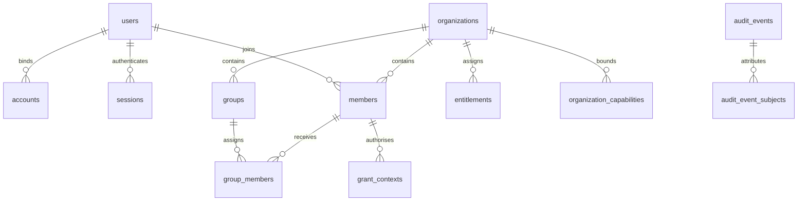

# Answerable ID schema foundation

This is the current storage contract. [Design](03-answerable-id.md) describes behaviour; [F0–F7](05-id-enterprise-foundation.md) defines acceptance. The unshipped development history is consolidated into one [initial SQL migration](../apps/id/drizzle/0000_initial.sql), one generated snapshot and one journal entry.

## Service contract

Bun, Hono and Better Auth 1.7.2 use Postgres for identity, sessions, protocol state, policy, audit and command recovery. The baseline has 28 tables, 27 custom functions, 61 triggers, 24 policies and eleven RLS-enabled tables. The [catalogue](../apps/id/src/__tests__/migration-catalog.json) preserves custom SQL that schema generation alone does not fully describe.

## Entity relationship diagram

Relations describe ownership, not physical deletion.

## Ownership

| Record                  | Security identity                                                                         |
| ----------------------- | ----------------------------------------------------------------------------------------- |
| User/account            | Global user UUID and unique upstream binding; never email linking.                        |
| Member/group/assignment | Tenant UUID, same-tenant foreign keys and immutable row UUIDs.                            |
| Client/resource         | Instance UUID, reserved public identifier and immutable ownership/classification.         |
| Capability              | Platform-approved tenant, exact targets, grant kind, scopes and effective window.         |
| Grant context           | Immutable authenticated user/member/tenant/client/resource and authentication provenance. |
| Audit/operation         | Permanent UUID attribution and reservations independent of product eligibility.           |

## Conventions

UUIDv7, timestamps, explicit validity predicates and monotonic revisions replace names as security identity. Window starts are inclusive and ends exclusive. Deleted rows are ineligible regardless of status/window.

Live uniqueness permits replacements only where explicitly defined. Group assignments have UUID primary keys. Partial entitlement/capability uniqueness uses `NULLS NOT DISTINCT`.

## Invariants

- Composite foreign keys reject cross-tenant member/group references.
- Tombstone rows keep unique public identifiers reserved after product deletion. Platform identity comes from immutable `system_bindings`; matching slugs cannot adopt it.
- Parent guards reject active children of deleted parents under locks.
- Session authentication and grant provenance cannot be rewritten by tenant selection.
- Native transaction/savepoint scope restores on success/failure; pooled connections retain no tenant authority.
- Successful effects, audit, subjects and command reservations commit together.

## Lifecycle values

Disabled state is reversible by explicit command. Membership revocation can be reinstated while the user, organisation and membership remain undeleted and eligible. Removed assignments and revoked grants stay removed/revoked. `deletedAt` is terminal product deletion; protocol consumption/expiry is separate.

## How the policy reads the schema

Registration limits vocabulary and identity; it does not grant permission. User access intersects own-tenant authentication, effective membership, capability and matching assignments. Client-only login and exact client–resource pairs are distinct. Refresh has an independent ceiling. Machine access uses owner, registration/link limits and its machine capability.

## Durable audit subjects

Audit tenant and subject references do not depend on live product eligibility. Trigger-owned subjects retain actor, target and affected-user UUIDs. Runtime cannot rewrite facts or invoke subject capture directly. Action plus schema version defines a payload; retained old versions do not imply missing historical facts exist.

Current deletion manifests describe product tombstones and actual credential clearing/revocation. Tenant client history exposes counts and a link to platform-only grant effects. The nullable indexed `operation_id` has a deferrable, initially deferred foreign key to permanent receipts: audit can precede the receipt inside the transaction but no dangling reference can commit.

## Runtime database permissions

Schema owner, runtime and replay-retention roles are separate. Runtime cannot DELETE/TRUNCATE product rows, rewrite audit, directly alter subjects/reservations or change system binding. Protocol records retain their consumption contract. Startup checks protected privileges, ownership and required RLS before listening.

RLS protects `groups`, `group_members`, `entitlements`, `organization_capabilities`, `grant_contexts`, `members`, `invitations`, `organization_domains`, `sso_providers`, `audit_events` and `audit_event_subjects`. Routing SELECT and audit INSERT remain available without scope. Native broker transactions use protocol scope; the fixed grant-provenance triggers run as their owner to validate parents and retain locks without granting membership writes to grant admission. This is targeted protection, not universal RLS. The [isolation inventory](../reports/answerable-id-isolation-inventory.md) records scopes and trusted exceptions.

## Completed administrative operations

All 49 mutations share the journal. Actor, tenant scope, operation kind, target and normalised input identify a reservation. Matching retries require current authority and return the existing result without repeating effects; mismatches conflict.

Reservations are permanent. Secret-bearing response ciphertext has a separate expiry/key ring. Purging expired ciphertext cannot execute the command again.

## Contract test

[Migration proof](../reports/id-initial-migration.md) covers empty installation, final-statement failure, SIGKILL before/after commit, retry, concurrent bootstrap and repeated startup preserving real writes. Catalogue checks cover functions, triggers, policies, constraints and permissions. A restore drill against production-shaped data remains a release input.

## Deferred

Physical product purge jobs and their duration are deferred. No named-identity recovery feature is required. DNS self-verification, guest opt-in, SCIM, external registration and remote logout delivery are outside this baseline; see the [plan](02-plan.md).

## Client configuration revisions

Conditional PATCH uses ETags. Security changes advance authorisation versions and revoke applicable stored grants. Public IDs/owners cannot be transferred to adopt old credentials.

## Resource configuration revisions

Conditional PATCH preserves immutable identity/classification. Scope/lifecycle changes affect current decisions. Deletion rejects retained live references, including inactive/future policy rows.

## Membership revocation

Removal revokes the membership and matching grants, soft-deletes direct assignments and preserves other tenants. Terminally deleted membership cannot be reinstated.

## Organisation authorization version

Security transitions advance the version. Re-enable alone cannot restore old token authority.

## Global session boundary

Browser sessions are global. Tenant APIs cannot enumerate/revoke them globally. Tenant deletion clears selection; platform session/user commands apply their explicit global effects.

## Authentication transaction boundary

Verified SSO provenance enters the session through the native callback transaction. Production OAuth binds current policy, actual signed/opaque output, persistence and mandatory version-four user audit before success. Client assertion replay protection stays consumed if later issuance rolls back.

## Resource link deletion boundary

Links have immutable UUIDs and terminal tombstones. Relinking creates a new relationship. Grant revocation is retained.

## Machine issuance evidence

Issue facts retain approved identity/policy and actual issue/expiry times. Rejection facts distinguish authenticated attribution from unattributed credential failures. Audit failure cannot turn refusal into success.

## Member command receipts

Window changes, removal and reinstatement share tenant authority, audit and replay. Before/after access is observed at each statement; it does not prove remote logout or isolate all concurrent causes.

## Domain command receipts

Lifecycle commands use current platform authority, routing state and repeat-safe results. Domain deletion cannot make an old grant eligible again.

## Organisation command receipts

Creation/configuration/lifecycle share the journal. Deletion retains tenant children as tombstones, clears selections and preserves global people.

## Keyed command fingerprints

Secret-bearing commands use keyed fingerprints with retained replay keys. Reference-only commands still use their digest format; the helper name “legacy” does not make it obsolete.

## SSO command receipts

PUT accepts optional expected absence or current revision; without a precondition it uses the current row. Old provider revisions cannot confer current authority. Audit redacts provider secrets.

## Group command receipts

Lifecycle shares the journal and revision checks. Deletion captures actual assignment/entitlement UUIDs.

### Group assignment identities

Every assignment has its own UUID/revision. Window PUT accepts an optional absence/revision precondition. Removal and re-creation are distinct identities.

### Entitlement command recovery

Original keys recover exact principal/target/scopes/window results; replay cannot broaden permission.

### Entitlement revisions

PATCH uses ETags. Changed broad assignments record actual audience sources without claiming every observed user gained/lost access.

### Global session command recovery

Revocation records actual session/token/grant effects. Old keys recover old commands; a new reconciliation uses a new key.

### Global user command recovery

Disable reconciles remaining local credentials even for an already-disabled user. Deletion retains UUID history and denies authority atomically with its receipt.

### Own operation status

Receipt inspection is actor-scoped with current administrative authority. It exposes a reference projection, not another actor's recovered secret.

## Organisation capability ceilings

Only platform writers approve ceilings. Registration, assignment and approval remain independent. Last-platform-writer guards cover capability, membership, group, entitlement, user, organisation and admin-resource changes.

## User grant context

One server-bound flow creates one immutable grant. Account, provider/revision, tenant and verified time stay fixed across code/refresh. Missing provenance cannot be upgraded from a current browser session.

### User-capability administration

Code, refresh, machine and direct admin-session grant kinds are explicit. One approval does not approve another.

## Native SSO session origin

Verified upstream `auth_time` is nullable and never replaced by broker creation time. Sensitive human commands require five-minute freshness before replay and after relevant waits. Linking requires two independent proofs and cannot transfer bindings.

## Soft deletion

Fifteen product tables carry `deletedAt`: users, organisations, accounts, members, invitations, groups, assignments, entitlements, domains, SSO providers, clients, resources, client-resource links, consents and capabilities.

Ordinary reads/authentication/authorisation exclude them. User deletion retires email and retains profile/bindings. Credentials are cleared/revoked; native sessions/token rows can be physically consumed/deleted. Grant contexts retain revocation; audit, reservations and recovery survive. This retains identifying data and is not anonymisation. See the [deletion report](../reports/id-soft-deletion.md) for precise manifests.
