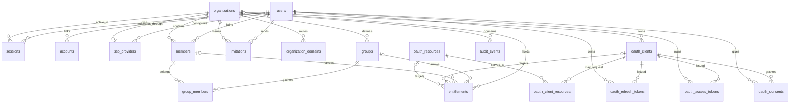

# Answerable ID schema foundation

> **TL;DR**
> - **Decides:** the approved first schema, ownership boundaries, identifiers, naming conventions, and invariants.
> - **Rule:** identifiers are application-generated UUIDv7 stored as PostgreSQL `uuid`, with two named exceptions; administrative changes go through the Hono API.
> - **Not here:** the detailed HTTP reference (generated from the public and admin contracts), OIDC grants for apps, and OAuth 2.1 for MCP servers.

## Service contract

Answerable ID lives in `apps/id`. Better Auth is mounted at `/auth/*` under `https://id.answerable.org`; the browser login, consent and error pages live in `apps/web` and use `AUTH_PAGES_URL`.

The platform organisation, admin API resource, `platform-admins` staff group and its entitlement are seeded at startup. Configure the platform domain, SSO provider and first staff member through the admin API using the root bearer.

The admin API lives under `/api/admin/v1`, with versioned Hono routes calling services and grouped query modules:

- **Summaries.** `/platform/summary` reports fleet counts and 24-hour sign-ins and denials; `/organizations/{organizationId}/summary` reports organisation counts and seven-day successful sign-ins.
- **Diagnostics.** `…/sign-in-diagnosis?email=` diagnoses database sign-in checks and membership windows; `…/sso-provider/test` checks outbound discovery and JWKS connectivity without sending credentials.
- **Caller.** `/me` returns the authenticated principal and effective grants.
- **Organisation configuration.** Organisations support list, create, read, update, disable, enable and erase; nested domains and the SSO provider support configuration and reads.
- **People.** Users support list, read, disable, enable, email retirement and erase; members support reads, window changes and removal, with user- and member-scoped session listing and revocation.
- **Access configuration.** Groups and group members, clients (including secret rotation, ownership and resource links), resources and entitlements have administrative routes; clients can be erased when no entitlement references them, and domains can be deleted.
- **Access reviews.** `…/members/{memberId}/access` and `…/access?client=|resource=` expose effective access.
- **Audit.** Staff read `/audit-events`; organisation admins read `/organizations/{organizationId}/audit-events`. Every administrative write is audited.

The admin API authenticates a Better Auth session cookie with a trusted origin, a bearer JWT for the admin resource, or the root admin secret (a break-glass principal audited as actor `system`/`root`, locked once a human holds `platform:write` unless break-glass is enabled). Entitlements grant the six `platform:*` and `org:*` scopes; `x-tier` marks staff-only (`platform`) and organisation-scoped (`tenant`) operations. Tenant admins can read their organisation's configuration and access, change member windows, remove members, and list or revoke member sessions; self-service configuration writes are not yet available.

**Contracts.** `/openapi.json` describes reachable public routes and is snapshotted in `apps/id/openapi.json`; `/api/admin/openapi.json` describes admin routes and is snapshotted in `apps/id/openapi.admin.json`. `bun run openapi:export` from `apps/id` generates both. The web docs publish both references; `/api/admin/docs` also provides interactive admin docs outside production.

Better Auth HTTP routes are deny-by-default. The allowlist exposes `GET /auth/ok`, `POST /auth/sign-in/sso`, `GET /auth/sso/callback`, `GET /auth/get-session`, `POST /auth/sign-out` and `POST /auth/oauth2/token` for `client_credentials` only. The OAuth provider and JWT plugins are registered; other OAuth provider routes are not yet exposed. Better Auth's organisation and client mutation endpoints are internal tools, not the supported administration API. Its client and resource endpoints additionally require a session and privilege hooks that deny by default.

## Entity relationship diagram

## Ownership

| Owner | Tables | Purpose |
| --- | --- | --- |
| Better Auth core and organization plugin | `users`, `sessions`, `accounts`, `verifications`, `organizations`, `members`, `invitations` | Authentication, sessions, upstream identities, organization compatibility |
| Better Auth JWT plugin | `jwks` | Token-signing keys; the row id is the `kid` |
| `@better-auth/sso` | `sso_providers` | One upstream OIDC provider configuration bound to each federated organization |
| `@better-auth/oauth-provider` | `oauth_clients`, `oauth_resources`, `oauth_client_resources`, `oauth_refresh_tokens`, `oauth_access_tokens`, `oauth_consents`, `oauth_client_assertions` | OIDC provider for our apps and OAuth 2.1 authorization server for MCP servers |
| Answerable | `organization_domains`, plus Answerable columns on `accounts` and `sso_providers`, `groups`, `group_members`, `entitlements`, `audit_events` | Tenant routing, immutable directory identity, groups, authorisation policy at every token grant, and audit records |

The vocabulary is OAuth's. A **client** is anything that requests tokens: an app users log into (an OmniChat cell, Circle) or a tool such as Claude Code. A **resource** is a protected resource the server issues access tokens for, identified by its RFC 8707 resource indicator, which is also the `aud` claim; MCP servers are resources, each with its own token policy (lifetime, allowed scopes, signing key). `oauth_client_resources` is the server-owned link deciding which clients may request tokens for which resources; a registering client can never grant itself one.

`oauth_clients.organization_id` is Answerable's column on a plugin table. The plugin's registration endpoints never set it: the adapter drops fields the plugin does not declare. Client ownership is administered only through the admin API and `src/db/queries/oauth-clients.ts`.

A **group** is a set of members within one organization. It either mirrors an upstream directory group (`external_id` set; membership is synced from the directory, never edited by hand) or is managed in Answerable ID.

An **entitlement** says who may obtain tokens for what, with which scopes. Its principal is the whole organization, one group, or one member. Its target is exactly one of a client (may these people use this app or tool) or a resource (may these people reach this MCP server). Grants are additive: a person is entitled when any active row matches them for the target, and scopes are the union of the matching rows. There are no deny rows; access is removed by disabling a row or leaving a group.

Better Auth columns beyond its own field set (`users.status`, `users.disabled_at`, `users.retired_email`, `accounts.directory_id`, `accounts.directory_user_id`, `organizations.status`, `organizations.disabled_at`, `organizations.updated_at`, `members.valid_from`, `members.valid_until`) are declared as additional fields in `src/auth.ts` and are never client input. Plugin tables keep the plugins' own property names; only physical names follow the conventions below. One consequence: `oauth_client_resources.resource_id` holds the resource identifier, not its row id.

## Conventions

- Physical names are plural `snake_case`; TypeScript properties are `camelCase`.
- Constraint and index names are the ones Drizzle generates: `<table>_pkey`, `<table>_<columns>_unique`, `<table>_<column>_<referenced table>_<column>_fk`, `<table>_<columns>_idx`, `<table>_<rule>_check`. A name is written explicitly, and shortened, only where the generated form would exceed PostgreSQL's 63 characters and be silently truncated. A unique *index* exists only where a constraint cannot express the rule (partial uniqueness). Pure join tables have a composite primary key and no surrogate id.
- Every timestamp is `timestamptz`. `created_at` defaults to `now()`. `updated_at` is set by Drizzle on every update it issues, including Better Auth's, through `$onUpdate`; there is no trigger, so raw SQL must set it itself. Token rows always carry an expiry.
- Identifiers are application-generated UUIDv7 (`Bun.randomUUIDv7`), shared by Better Auth, its plugins, and the query modules, with no database default so a raw insert without an id fails. Two exceptions are `text` because Better Auth computes the id itself as a digest: `verifications.id` (reservation locks) and `oauth_client_assertions.id` (single-use `private_key_jwt` assertion ids, where a replay collides on the primary key). Re-check for computed ids (`forceAllowId` in the Better Auth sources) whenever a plugin is added.
- Each vocabulary lives once in `src/db/schema/vocabulary.ts`. The Drizzle column type, the CHECK constraint, and the Better Auth field type all derive from that list.
- Every `status` column is CHECK-constrained. `users` and `organizations` also carry `disabled_at`, which is set exactly when the status is `disabled`, because those two gate login and the offboarding SLA. Plugin tables use the plugins' own `disabled` flags. Deletion is erasure: cascades exist for erasure; normal offboarding is `disabled`.

## Invariants

- **Audit events** are append-only: application code never updates or deletes rows. Organisation erasure sets `organization_id` to NULL; `target_id` keeps erased ids as text. Actor (`user`, `client`, `system`) and outcome (`success`, `failure`, `denied`) vocabularies are CHECK-constrained; `denied` means an authenticated principal was refused by authorisation. Authentication records `auth.signin.succeeded`, `auth.signin.rejected` and `auth.signout`.
- User emails are unique, trimmed, and lowercase. A disabled user has `disabled_at`; other states do not.
- A retired email exists only while the user is disabled. The login email is `<user id>@retired.invalid` if and only if `retired_email` is set; retirement is terminal.
- External accounts are unique by `(issuer, account_id)`, matching Better Auth 1.7's issuer-scoped account keys. When present, `directory_user_id` is also unique per issuer; `directory_id` stores Entra `tid` or Google `hd`, while `directory_user_id` stores Entra `oid` or the provider `sub`.
- Each SSO provider has a globally unique stable `provider_id`, conventionally the organization slug, and each organization has at most one provider row. Its organization is required and cascades on erasure; its optional configuring user is detached on erasure. Provider domains use the same normalized-host grammar as organization domains.
- Organization slugs are unique and match `^[a-z0-9]+(-[a-z0-9]+)*$`, the Omni-Weaver tenant ID grammar. Better Auth itself only checks that a slug is non-empty. Group slugs follow the same grammar and are unique per organization.
- Membership is unique by `(organization_id, user_id)`. `(organization_id, id)` is also unique on `members` and on `groups` so group membership and entitlements can reference both at once. `members.role` is Better Auth state, may hold a comma-separated list, and confers no authority in Answerable ID; entitlements do.
- A group's `external_id` is unique per organization when set. Group membership is keyed by `(group_id, member_id)`; both composite foreign keys carry the organization, so a group cannot contain another organization's member. Removing a member removes their group memberships and member-specific grants; removing a group removes its memberships and grants.
- Domains are stored lowercase as ASCII host names with at least two labels (internationalized names as punycode). A domain has at most one **active** organization and appears at most once per organization. Moving a domain means disabling the old row, then adding the new one; `findOrganizationByDomain` therefore returns one organization or null, and ambiguity cannot exist in the data.
- An entitlement has at most one of `member_id` and `group_id`, and exactly one of `client_id` and `resource`. It is unique by `(organization_id, member_id, group_id, client_id, resource)` with `NULLS NOT DISTINCT`, so the organization-wide row is unique too. Scopes are non-empty and contain no empty string. Member- and group-specific rows use composite foreign keys with the organization, so they cannot point across organizations. A client or resource referenced by an entitlement cannot be deleted; disable it instead.
- Client ids and resource identifiers are globally unique. Deleting a client removes its links, tokens, and consents; deleting a resource removes its links. Sessions detach from tokens (`set null`); users take their tokens and consents with them.
- Client ownership is nullable and deletion-restricted. A client without an owning `organization_id` cannot obtain machine tokens.
- Members, group memberships, and entitlements have nullable effective windows with `valid_from < valid_until`. Windows are half-open: `valid_from` is inclusive, `valid_until` is exclusive, and NULL is unbounded. A row is effective when its status is active where present and `now()` is inside the window.
- `sessions.active_organization_id` is organization-plugin state for Better Auth's own routes. It is never an authorization input; the token's organization comes from membership.
- `invitations` stays because the organization plugin deletes members and invitations when an organization is deleted through it. Its `status` is constrained to Better Auth's vocabulary. Invitations are not an Answerable administrative capability in this milestone.

## Lifecycle values

| Entity | Values |
| --- | --- |
| User status | `inert`, `active`, `disabled` |
| Organization, domain, group, and entitlement status | `active`, `disabled` |
| Invitation status (Better Auth) | `pending`, `accepted`, `rejected`, `canceled` |
| Client and resource | the plugins' `disabled` flag |
| Effective windows | nullable `valid_from` / `valid_until`; half-open, NULL unbounded |
| Email retirement | terminal transition after `disabled` |
| Audit | actor: `user`, `client`, `system` · outcome: `success`, `failure`, `denied` |

`inert` means imported and not yet bound to an upstream identity. The SSO user-resolution hook owns activation and every federation write inside the login transaction; Better Auth's implicit create-user path is unreachable. A new verified identity is created active, while an imported identity becomes active only when its immutable directory key matches. The Entra placeholder account uses `account_id = 'import:<oid>'` and `directory_user_id = <oid>` (with `directory_id = tid`) until first login rewrites `account_id` to the verified `sub`.

`retired.invalid` is never a login email or an organization domain.

## How the policy reads the schema

For implemented admin access checks, the policy applies `isEffective` to the member, group-membership, and entitlement rows. For a session, it collects the member's effective groups and entitlements for the admin resource, where the principal is the organisation, one of those groups, or the member. Applying entitlements at every app or MCP token grant is not yet implemented; see [`02-plan.md`](02-plan.md).

`effectiveGrants` in `src/db/queries/grants.ts` implements this computation for resource targets and returns per-organisation scope unions. The admin API’s access views (`…/members/{memberId}/access` and `…/access?client=|resource=`) expose this computation for access reviews.

Machine callers are authorized by the per-client scope ceiling and `oauth_client_resources`. Their token's organization claim comes from `oauth_clients.organization_id`; NULL denies `client_credentials`.

## Contract test

`src/db/schema.integration.test.ts` freezes the PostgreSQL catalog: every column with its type, nullability, and default; every constraint with its definition; every index. It also drives Better Auth and the OAuth provider through their own APIs against the schema. A schema change is a deliberate edit to that snapshot, reviewed against this document.

## Deferred

- **Group sync from directories.** The federation milestone maps the upstream `groups` claim (Entra object ids, Google groups) onto `groups.external_id` and refreshes `group_members` at login; SCIM comes later.
- **Encrypting upstream IdP tokens.** `accounts.access_token`, `refresh_token`, and `id_token` are stored as Better Auth writes them. Enable `account.encryptOAuthTokens` before the first real login so no plaintext token row ever exists; it binds those rows to `BETTER_AUTH_SECRET`, which the key-custody milestone must account for. The same milestone decides how `jwks.private_key`, encrypted with the same secret today, moves to a KMS or a separate key-encryption key.
- **Domain verification** (`verified_at`). Domains are configured by staff through the admin API; verification becomes mandatory the day organization admins can add their own.
- An index on `users.retired_email`.
- A CHECK excluding `.invalid` from `organization_domains`.
- OIDC consent grants, legacy-import tooling, SCIM, DPoP, token-exchange, outbox, and Redis tables do not exist yet. The browser login, consent and error pages exist; OIDC grants for apps are not yet available.

Migrations live in `apps/id/drizzle` and are generated with `bun run db:generate` from `apps/id`. The disposable test database is built from the committed migrations; a drift test fails when the schema and migrations disagree.
