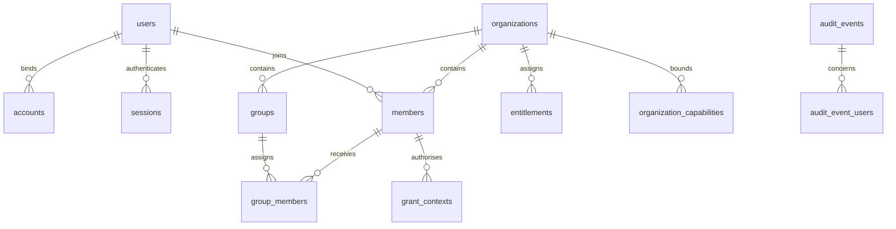

# Answerable ID schema foundation

This is the current storage contract. [Design](03-answerable-id.md) describes behaviour; [F0–F7](05-id-enterprise-foundation.md) defines acceptance. The unshipped development history is consolidated into a generated [initial migration](../apps/id/drizzle/0000_initial.sql) and a reviewed [invariants migration](../apps/id/drizzle/0001_invariants.sql); see [the layout](../apps/id/README.md#commands).

## Service contract

Bun, Hono and Better Auth 1.7.2 use Postgres for identity, sessions, protocol state, policy, audit and command recovery. The baseline has 25 tables, 15 custom functions, 36 triggers, 20 policies and ten RLS-enabled tables. The invariants migration holds the custom SQL that drizzle-orm cannot express. A [catalogue-equivalence test](../apps/id/src/db/migrations.integration.test.ts) proves the committed migrations build exactly what the schema modules generate plus that file.

## Entity relationship diagram

```mermaid
erDiagram
  users ||--o{ accounts : binds
  users ||--o{ sessions : authenticates
  users ||--o{ members : joins
  organizations ||--o{ members : contains
  organizations ||--o{ groups : contains
  groups ||--o{ group_members : assigns
  members ||--o{ group_members : receives
  organizations ||--o{ entitlements : assigns
  organizations ||--o{ organization_capabilities : bounds
  members ||--o{ grant_contexts : authorises
  audit_events ||--o{ audit_event_users : concerns
```

Relations describe ownership, not physical deletion.

## Ownership

| Record                  | Security identity                                                                         |
| ----------------------- | ----------------------------------------------------------------------------------------- |
| User/account            | Global user UUID and unique upstream binding; never email linking.                        |
| Member/group/assignment | Tenant UUID, same-tenant foreign keys and immutable row UUIDs.                            |
| Client/resource         | Instance UUID, reserved public identifier and immutable ownership/classification.         |
| Capability              | Platform-approved tenant, exact targets, grant kind, scopes and effective window.         |
| Grant context           | Immutable authenticated user/member/tenant/client/resource and authentication provenance. |
| Audit/operation         | Permanent UUID attribution and reservations independent of product eligibility.           |

## Conventions

UUIDv7, timestamps, explicit validity predicates and monotonic revisions replace names as security identity. Window starts are inclusive and ends exclusive. Deleted rows are ineligible regardless of status/window.

Live uniqueness permits replacements only where explicitly defined. Group assignments have UUID primary keys. Partial entitlement/capability uniqueness uses `NULLS NOT DISTINCT`.

## Invariants

- Composite foreign keys reject cross-tenant member/group references.
- Tombstone rows keep unique public identifiers reserved after product deletion. Platform identity comes from immutable `system_bindings`; matching slugs cannot adopt it.
- **Live foreign keys hold soft deletion.** Each soft-deletable table has a `live` column: true while `deleted_at` is null, null once it is set. Parents carry `unique (id, live)` and children reference `(parent_id, live)`, so a live row needs live parents and a parent with live children cannot be deleted. `system_bindings` keeps the platform organisation, its admin group and the admin resource live. Every deletion path soft-deletes children first.
- **A deleted row holds no authority.** Per-table CHECKs require a disabled or revoked status, and no client secret, account tokens, password or OIDC configuration. A trigger keeps deletion terminal and assigns `live`; writers never set it.
- **Sessions and tokens carry no liveness guard.** The issuing transaction checks and locks the user and client, and erasure deletes their sessions and tokens.
- **Trigger functions cannot be shadowed.** They schema-qualify every relation and search `pg_temp` last; the runtime role cannot create temporary tables.
- Session authentication and grant provenance cannot be rewritten.
- Native transaction/savepoint scope restores on success/failure; pooled connections retain no tenant authority.
- Successful effects, audit, audit users and command reservations commit together.

## Lifecycle values

Disabled state is reversible by explicit command. Membership revocation can be reinstated while the user, organisation and membership remain undeleted and eligible. Removed assignments and revoked grants stay removed/revoked. `deletedAt` is terminal product deletion; protocol consumption/expiry is separate.

## How the policy reads the schema

Registration limits vocabulary and identity; it does not grant permission. User access intersects own-tenant authentication, effective membership, capability and matching assignments. Client-only login and exact client–resource pairs are distinct. Refresh has an independent ceiling. Machine access uses owner, registration/link limits and its machine capability.

## Durable audit subjects

Audit tenant and user references do not depend on live product eligibility. `audit_event_users (user_id, event_id)` lists the users each event concerns: a user actor; the user, membership, group-membership, session or grant target; the member an entitlement names; and the users the action's manifests name (`audience`, `policySources.assignments`, revoked grant contexts, revoked, deleted or cleared tokens, consents and members). The two audit triggers fill it as the table owner; runtime cannot write it, and only platform scopes read it.

Current deletion manifests describe product tombstones and actual credential clearing/revocation. Tenant client history exposes counts and a link to platform-only grant effects. The nullable indexed `operation_id` has a deferrable, initially deferred foreign key to permanent receipts: audit can precede the receipt inside the transaction but no dangling reference can commit.

### Audit actions

Every event has `schema_version` 1, and each action one `data` shape; the first payload change after launch adds version 2. `reason` holds a refusal or failure code. Optional keys are marked. A [test](../apps/id/src/db/queries/audit.test.ts) keeps this table equal to the actions ID writes.

| Action | `data` |
| ------ | ------ |
| `admin.auth_failed` | `claimedClientId` when a bearer named a client, otherwise null. |
| `admin.denied` | `organizationId` when the path names an organisation the principal holds no grant for, otherwise null. |
| `admin.root_request` | `organizationId` from the path, otherwise null. |
| `auth.signin.succeeded` | `userId`, `authenticationAccountId`, `authenticationProviderId`, `authenticationProviderRevision`, `upstreamAuthTime`. |
| `auth.signin.rejected`, `auth.signout` | Null. |
| `bootstrap.applied` | What the start created or updated: `organization`, `resource`, `capability`, `group`, `entitlement`. |
| `capability.created`, `capability.updated`, `capability.update_unchanged` | `before` (null on creation), `after`. |
| `capability.removed`, `domain.deleted`, `group_member.removed` | `before`, `after`, `deletionMode: "soft"`; `group_member.removed` adds `groupId`. |
| `client.created`, `resource.created` | `before: null`, `after`. |
| `client.updated`, `client.update_unchanged`, `resource.updated`, `resource.update_unchanged` | `requestedFields`, `before`, `after`. |
| `client.enabled`, `client.disabled`, `client.state_unchanged` | `before`, `after`, `effects` (token counts), optional `grantEffectsEventId`. |
| `client.secret_rotated` | `before` and `after` `authorizationVersion`, `effects` (`credentialChanged`, token counts), optional `grantEffectsEventId`. |
| `client.owner_unchanged` | `before` and `after` `organizationId`, `changed: false`. |
| `client.resource_linked`, `client.resource_unlinked`, `client.resource_unchanged` | `resource`, `relationship` (`id`, `deletedAt`; null without an effect), `resourceInstanceId`, `resourceClassification`, `resourceOrganizationId`, `before` and `after` `linked`. |
| `client.grants_revoked` | Platform only: `clientInstanceId`, `grantContexts`, `revokedTokens` (`access`, `refresh`: row and user IDs). |
| `client.grants_erased` | Platform only: `clientInstanceId`, `grantContexts`, `effects` (deleted tokens, soft-deleted consents and links), `deletionMode`. |
| `client.erased` | `before`, `after`, `deletionMode`, `effects` (counts), optional `grantEffectsEventId`. |
| `domain.created` | `domain`, `before: null`, `after`. |
| `domain.enabled`, `domain.disabled`, `domain.enable_unchanged`, `domain.disable_unchanged` | `status`, `before`, `after`. |
| `entitlement.created`, `entitlement.updated`, `entitlement.enabled`, `entitlement.disabled` | `before` (null on creation), `after`, `audience`: the memberships the entitlement reaches (its member, its group's assignments, or every member). |
| `entitlement.removed` | `before`, `after`, `deletionMode`, `audience`. |
| `entitlement.update_unchanged`, `entitlement.enable_unchanged`, `entitlement.disable_unchanged` | `before`, `after`. |
| `group.created`, `group.updated`, `group.update_unchanged`, `group.enable_unchanged`, `group.disable_unchanged` | `before` (null on creation), `after`. |
| `group.enabled`, `group.disabled` | `before`, `after`, `policySources` (`assignments`, `entitlements`). |
| `group.erased` | `before`, `after`, `deletionMode`, `effects` (`softDeletedAssignments`, `softDeletedEntitlements`). |
| `group_member.added`, `group_member.updated`, `group_member.update_unchanged` | `groupId`, `before` (null when added), `after`. |
| `identity.linked` | `initiatingSessionId`, `initiatingAccountId`, `authenticationProviderId`, `authenticationProviderRevision`, `upstreamAuthTime`, `flowId`. |
| `member.updated` | `changes`, `before`, `after`, each state with its `access`. |
| `member.removed`, `member.removal_unchanged` | `userId`, `reason`, `before`, `after` (with `access`), `effects` (`removedGrants`, `softDeletedGroups`, `revokedGrantContexts`). |
| `member.reinstated`, `member.reinstatement_unchanged` | `userId`, `reason`, `before`, `after` (with `access`). |
| `oauth.token.issued` | `decision`, `issuedAt`, `expiresAt`. |
| `oauth.token.rejected` | `grantType`, `stage`, `authenticatedClient` and `decision` (both null when client authentication failed). |
| `oauth.user.authorized`, `oauth.user.denied` | `scopes`, `decision`. |
| `oauth.user.issued`, `oauth.user.replayed` | `grantType`, `scopes`, `decision`. |
| `oauth.user.revoked` | `reason` (`authorization_code_replay`, `refresh_token_replay`, `revocation_request`), `effect` (`grant`, `refresh_family`, `access_token`). |
| `organization.created`, `organization.updated`, `organization.update_unchanged`, `organization.enabled`, `organization.enable_unchanged` | `before` (null on creation), `after`. |
| `organization.disabled`, `organization.disable_unchanged` | `before` and `after` (`status`, `authorizationVersion`), `effects` (`revokedMachineAccessTokenIds`, `revokedGrantContexts`). |
| `organization.erased` | `before`, `after`, `deletionMode`, `revokedGrantContexts`, `effects` (the soft-deleted entitlements, assignments, members, groups, capabilities, domains and SSO providers). |
| `resource.enabled`, `resource.disabled`, `resource.state_unchanged` | `before`, `after`, `effects.revokedGrantContexts`. |
| `resource.erased` | `before`, `after`, `deletionMode`, `revokedGrantContexts`. |
| `session.revoked` | `userId`, `before`, `after: null`, `sessionIds`, `revokedGrantContexts`, token counts, `revokedTokens`. |
| `session.revoked_all` | `userId`, `sessions`, `sessionIds`, `revokedGrantContexts`, token counts, `revokedTokens`. |
| `sso_provider.created`, `sso_provider.updated`, `sso_provider.update_unchanged` | `before` (null on creation), `after`, `credentialsChanged`, `effects.revokedGrantContexts`. |
| `sso_provider.deleted` | `before`, `after` (with `credentialsCleared`), `deletionMode`, `effects.revokedGrantContexts`. |
| `user.enabled`, `user.enable_unchanged`, `user.email_retired`, `user.email_retirement_unchanged` | `before`, `after`. |
| `user.disabled`, `user.disable_unchanged` | `before`, `after`, `sessions`, `sessionIds`, `revokedGrantContexts`, token counts, `revokedTokens`. |
| `user.erased` | `before`, `after`, `deletionMode`, `revokedGrantContexts`, `effects` (deleted tokens and sessions, soft-deleted consents, entitlements, assignments, members and accounts, cleared token sessions). |

## Runtime database permissions

Schema owner and runtime roles are separate. Runtime cannot DELETE/TRUNCATE product rows or grant contexts, rewrite audit, write audit users, alter reservations, change system binding or create temporary tables. Those privileges, not triggers, keep bindings and operation receipts immutable. Protocol records retain their consumption contract. Startup checks protected privileges, ownership, `TEMP` and required RLS before listening.

RLS protects `groups`, `group_members`, `entitlements`, `organization_capabilities`, `grant_contexts`, `members`, `organization_domains`, `sso_providers`, `audit_events` and `audit_event_users`. Routing SELECT and audit INSERT remain available without scope. Native broker transactions use protocol scope; the grant-provenance trigger runs as its owner to validate parents and lock the member and session without granting membership writes to grant admission. This is targeted protection, not universal RLS. The [isolation inventory](../reports/answerable-id-isolation-inventory.md) records scopes and trusted exceptions.

## Completed administrative operations

All 49 mutations share the journal. Actor, tenant scope, operation kind, target and normalised input identify a reservation. Matching retries require current authority and return the receipt without repeating effects; mismatches conflict.

Reservations are permanent. Replays return receipts at the original status code, with an empty body for 204. Response bodies are not stored.

## Contract test

`test:migrations` proves an empty installation and a repeated run that applies nothing and preserves real writes. The catalogue-equivalence test covers tables, constraints, indexes, functions, triggers, policies and permissions. Bootstrap tests cover concurrent first starts; migration refuses an applied file that changed. Statement failure and process death need no proof of ours: the migrator applies every pending file in one transaction. A restore drill against production-shaped data remains a release input.

## Deferred

ID deletes expired sessions, OAuth access and refresh tokens and client assertions on a timer: protocol expiry is not product deletion and records no audit. Physical product purge jobs and their duration remain deferred. No named-identity recovery feature is required. DNS self-verification, guest opt-in, SCIM, external registration and remote logout delivery are outside this baseline; see the [plan](02-plan.md).

## Client configuration revisions

Conditional PATCH uses ETags. Security changes advance authorisation versions and revoke applicable stored grants. Public IDs/owners cannot be transferred to adopt old credentials.

## Resource configuration revisions

Conditional PATCH preserves immutable identity/classification. Scope/lifecycle changes affect current decisions. Deletion rejects retained live references, including inactive/future policy rows.

## Membership revocation

Removal revokes the membership and matching grants, soft-deletes direct assignments and preserves other tenants. Terminally deleted membership cannot be reinstated.

## Organisation authorization version

Security transitions advance the version. Re-enable alone cannot restore old token authority.

## Global session boundary

Browser sessions are global. Tenant APIs cannot enumerate/revoke them globally. Tenant deletion leaves them in place; platform session/user commands apply their explicit global effects.

## Authentication transaction boundary

Verified SSO provenance enters the session through the native callback transaction. Production OAuth binds current policy, actual signed/opaque output, persistence and mandatory user OAuth audit before success. Client assertion replay protection stays consumed if later issuance rolls back.

## Resource link deletion boundary

Links have immutable UUIDs and terminal tombstones. Relinking creates a new relationship. Grant revocation is retained.

## Machine issuance evidence

Issue facts retain approved identity/policy and actual issue/expiry times. Rejection facts distinguish authenticated attribution from unattributed credential failures. Audit failure cannot turn refusal into success.

## Member command receipts

Window changes, removal and reinstatement share tenant authority, audit and replay. Before/after access is observed at each statement; it does not prove remote logout or isolate all concurrent causes.

## Domain command receipts

Lifecycle commands use current platform authority, routing state and repeat-safe results. Domain deletion cannot make an old grant eligible again.

## Organisation command receipts

Creation/configuration/lifecycle share the journal. Deletion retains tenant children as tombstones and preserves global people.

## Keyed command fingerprints

Administrative commands use a SHA-256 digest of canonical identity and input. Permanent reservations retain outcome, status and result reference, without response bodies.

## SSO command receipts

PUT accepts optional expected absence or current revision; without a precondition it uses the current row. Old provider revisions cannot confer current authority. Audit redacts provider secrets.

## Group command receipts

Lifecycle shares the journal and revision checks. Deletion captures actual assignment/entitlement UUIDs.

### Group assignment identities

Every assignment has its own UUID/revision. Window PUT accepts an optional absence/revision precondition. Removal and re-creation are distinct identities.

### Entitlement command recovery

Original keys return receipts; replay cannot broaden permission.

### Entitlement revisions

PATCH uses ETags. Changed entitlements record their audience (the member, the group's assignments or every member) without claiming every observed user gained/lost access.

### Global session command recovery

Revocation records actual session/token/grant effects. Old keys recover old commands; a new reconciliation uses a new key.

### Global user command recovery

Disable reconciles remaining local credentials even for an already-disabled user. Deletion retains UUID history and denies authority atomically with its receipt.

### Operation status

Receipt inspection requires current platform audit authority and exposes the outcome, status and result reference.

## Organisation capability ceilings

Only platform writers approve ceilings. Registration, assignment and approval remain independent.

## User grant context

One server-bound flow creates one immutable grant. Its authentication evidence is copied from the session's origin into four columns named as on `sessions`: `authentication_account_id`, `authentication_provider_id`, `authentication_provider_revision` and nullable `upstream_auth_time`. One insert trigger checks them against the session, with the member, user, organisation and client, under the member and session locks. Account, provider revision, tenant and verified time stay fixed across code and refresh. Grants are never deleted: runtime has no DELETE on `grant_contexts`, and its five foreign keys restrict.

### User-capability administration

Code, refresh, machine and direct admin-session grant kinds are explicit. One approval does not approve another.

## Native SSO session origin

Verified upstream `auth_time` is nullable and never replaced by broker creation time. Sensitive human commands require five-minute freshness before replay and after relevant waits. Linking requires two independent proofs and cannot transfer bindings.

## Soft deletion

Fourteen product tables carry `deletedAt`: users, organisations, accounts, members, groups, assignments, entitlements, domains, SSO providers, clients, resources, client-resource links, consents and capabilities.

Ordinary reads/authentication/authorisation exclude them. User deletion retires email and retains profile/bindings. Credentials are cleared/revoked; native sessions/token rows can be physically consumed/deleted. Grant contexts retain revocation; audit, reservations and recovery survive. This retains identifying data and is not anonymisation. See the [deletion report](../reports/id-soft-deletion.md) for precise manifests.
