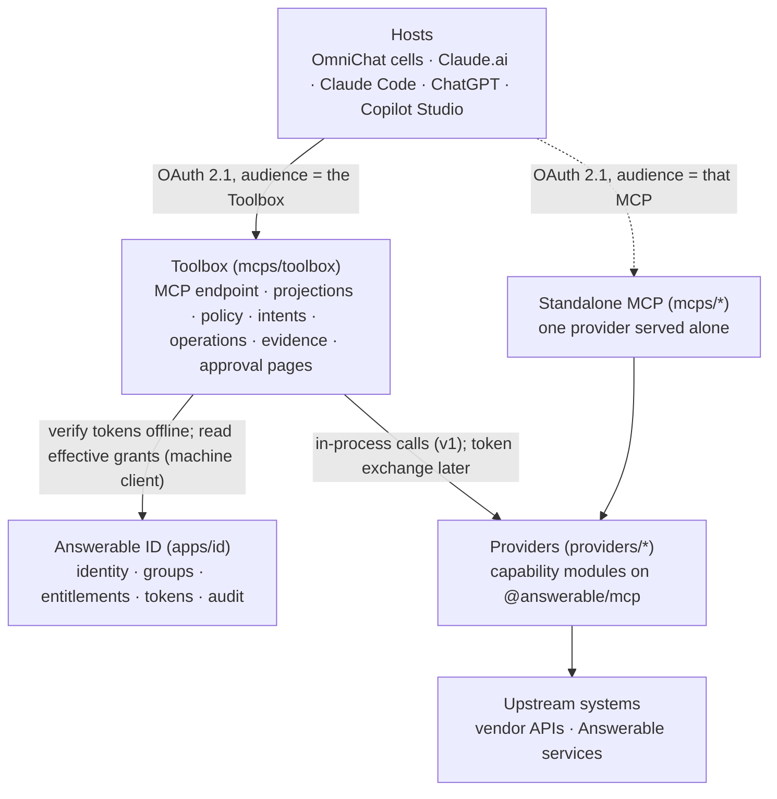

# Capability platform: Answerable Toolbox

> **TL;DR**
> - **Decides:** how Answerable builds governed MCP capabilities, how one hub (the Toolbox) exposes an organisation's capabilities to every AI app, and how Answerable ID decides who may use what.
> - **Rule:** a capability is data with a stable identity; every use crosses one authority boundary; state changes are prepared before they are committed.
> - **Not here:** the rules an author follows ([`09-mcp-design-standard.md`](09-mcp-design-standard.md)), the build order ([`10-capability-platform-plan.md`](10-capability-platform-plan.md)), the evidence ([research](../reports/mcp-platform-research-2026-09-28.md)), the MCP foundation already built ([`07-mcp-platform-draft.md`](07-mcp-platform-draft.md)).

This design is implemented as far as the goal of [`10-capability-platform-plan.md`](10-capability-platform-plan.md) goes; "Not yet." marks the rest.

## Purpose

Client organisations use AI from several applications: OmniChat, Claude, ChatGPT, Copilot, Claude Code. Answerable builds bespoke capabilities for them (documents, projects, CRM, the community, Answerable's own administration). The organisation should add one MCP server to each application and get, in every one of them, exactly the capabilities its administrators have granted to that person, governed and audited the same way. Developers, first Answerable's and later outsiders, should build a new capability from one package, one definition and one test, and have it discovered, governed and composed by infrastructure they never see.

The product is the Toolbox. The capability platform is what makes it work: the SDK that defines capabilities, the hub that serves them, Answerable ID that decides authority, and the evidence that records what happened.

## Glossary

| Term | Meaning |
| --- | --- |
| **Capability** | One useful, typed, bounded operation with a stable identity, classified as read, mutate, start or subscribe. Defined with `defineTool` in `@answerable/mcp`. |
| **Provider** | A named module of capabilities with one owner and one version, for example `acc` (Autodesk Construction Cloud) or `admin` (Answerable staff's administration of ID, served alone: [`11-admin-mcp.md`](11-admin-mcp.md)). Mounted in the hub or served alone. |
| **Toolbox** | The hub: one MCP server per deployment that serves every organisation, resolves the organisation and person from the Answerable ID token, and projects that person's granted capabilities as MCP tools. |
| **Projection** | How the hub turns granted capabilities into MCP tools for one caller: a direct list, or meta-tools (search, describe, execute, prepare, commit). |
| **Grant string** | The name an entitlement carries for the Toolbox resource: a capability identity, a domain family or a provider family. Answerable ID stores it; the hub interprets it. |
| **Catalogue** | The capabilities an organisation may use at all, enabled per provider pack by platform staff. The ceiling; entitlements choose within it. |
| **Intent** | An immutable prepared mutation: what would change, against which resource versions, under which policy class, with a single-use commit token. |
| **Policy class** | Who may commit an intent: `agent`, `controlled` (the host confirms), `human` (an approval record from a person), or `denied`. |
| **Receipt** | The immutable record of a committed intent. |
| **Operation** | A handle for work that continues after the call returns. |
| **Evidence** | The hub's append-only, hash-chained record of capability calls and mutation lifecycles. |
| **Host** | The application holding the MCP client: OmniChat (a LibreChat fork), Claude.ai, Claude Code, ChatGPT, Copilot Studio. Each is a registered client in Answerable ID. |

## Architecture



| Workspace | Responsibility |
| --- | --- |
| `packages/auth` | Verify Answerable ID access tokens. Unchanged, plus an opt-in list of accepted subject types later. |
| `packages/mcp` | The SDK: `defineTool`, `defineMutation`, `defineProvider`, `createMcpServer`, the manifest export, the conformance kit, the in-process test client. Becomes the public SDK. |
| `mcps/toolbox` | The hub: Hono service with the MCP endpoint, the grants reader, the catalogue, intents, approvals, receipts, operations, evidence, the approval pages, the platform-tier admin API and the worker. |
| `providers/*` | Capability modules. Each has a manifest, a conformance test and its own upstream client. |
| `mcps/*` | Standalone servers wrapping one provider for hosts that connect to it directly; `mcps/e2e` stays the reference server, the first provider mounted in the Toolbox and the acceptance. |
| `packages/acceptance` | The acceptance kit extracted from `mcps/e2e`: the ID fixture, the SDK OAuth client and the browser sign-in, shared by every acceptance journey. |
| `apps/id` | Unchanged data model. Gains a tenant-tier write surface for groups and entitlements, host registration (CIMD and policy-gated DCR) and, later, token exchange. |

Two deployment shapes serve the same definitions. A provider mounted in the hub is called in process, so no token crosses a boundary. A provider served alone is an MCP server with its own resource identifier, as `mcps/e2e` is today. A remote provider called by the hub over MCP needs a token for that provider's audience, which Answerable ID does not issue to the hub today. **Not yet:** remote providers; they arrive with RFC 8693 token exchange in ID (already on the backlog in [`02-plan.md`](02-plan.md#backlog-after-the-fleet-migrates)).

## Capability model

A capability is frozen data produced by `defineTool` (a mutation by `defineMutation`). The fields are the contract; the manifest is their serialisation; the conformance kit checks them. Only `name`, `description`, `input`, `output` and a handler are written by an author; every other field has a default, so a read tool is five fields and a mutation is those plus `prepare` and `commit`.

| Field | Rule |
| --- | --- |
| `name` | `<domain>.<operation>`, each part `^[a-z][a-z0-9]{0,15}$`, unique within its provider. The fully qualified identity is `<provider>/<domain>.<operation>` and never changes for the life of the capability. |
| `version` | A date, `YYYY-MM-DD`; defaults to the provider's version. Behaviour of one `(identity, version)` never changes. A deprecated tool names its current replacement in the same provider. Two versions of one name served side by side: Not yet, until the hub can pin a version per organisation. |
| `kind` | `read`, `mutate`, `start` or `subscribe`; defaults to `read`, and to `mutate` when the definition carries `prepare` and `commit`. `subscribe`: Not yet. |
| `title`, `description` | Operational documentation: what it does, when to use it, limits, what changes, what identifiers mean. Description length 40 to 1,000 characters. |
| `input`, `output` | Zod object schemas, converted to JSON Schema 2020-12. `additionalProperties: false` on the input. Every list-shaped read takes `limit` (default at most 20, maximum enforced) and `cursor`, and returns `items`, `next_cursor` and `has_more`. |
| `risk` | For `mutate` and `start`: `low`, `normal` (default) or `high`. Sets the default policy class: `agent`, `controlled`, `human`. |
| `effects` | For `mutate` and `start`: the vocabulary of side effects the preview can name: `notification`, `external_call`, `money_movement`, `cascade_delete`, `permission_change`, `publication`. |
| `cost_units` | Fixed (default 1), or `estimated` for upstreams priced per use. Drives budgets. |
| `deprecated` | Optional `{ since, sunset, replacement }`. Mirrored into the description. |
| `execute` (read, start) or `prepare` and `commit` (mutate) | The handlers, see below. |

The MCP tool a capability becomes:

- Name: the identity with `.` replaced by `_`; in the hub, prefixed with the provider id and `_`. A provider id is `^[a-z][a-z0-9]{0,11}$`, so a hub tool name is at most 46 characters of `[a-z0-9_]`. Every host in the research accepts that form, including OpenAI's 64-character limit after LibreChat's `_mcp_<server>` suffix.
- Annotations derived from `kind`: read gives `readOnlyHint: true`, `destructiveHint: false`, `idempotentHint: true`; a mutation's prepare tool gives `readOnlyHint: true`, `idempotentHint: true` (preparing has no business effect); start gives `readOnlyHint: false`, `destructiveHint: false`. `openWorldHint` comes from the provider. Annotations are set honestly for hosts and never read for authorisation.
- `_meta["com.answerable/capability"]` = `{ identity, version, kind, risk, policy_class, deprecated }`. `policy_class` is the class the caller would get for that capability in that organisation, so a host or the model can see it before calling.
- `_meta["anthropic/requiresUserInteraction"]: true` on the confirmed commit tool (below), and on no other tool.
- Output: `structuredContent` validated against `output`, undeclared fields dropped, the same JSON mirrored as text (LibreChat and Claude Code need it).
- Errors: an `isError` result whose single text block is the error envelope in [`09-mcp-design-standard.md`](09-mcp-design-standard.md#errors) as JSON, with no `structuredContent`: MCP TypeScript SDK 1.x clients (LibreChat) validate `structuredContent` against the output schema even on errors and refuse the result, while every host reads the text of an error result. Input validation failures are tool errors, not protocol errors, so the model can repair the call.

The manifest is `manifest(provider)`: a JSON document with the provider's id, version, owner, every capability's metadata and schemas, and no code. Each provider commits its manifest next to its source and a test fails on drift, as `apps/id/openapi.json` does today. The hub ingests manifests; a future public catalogue reads the same file.

Prompts, resources and MCP Apps views remain what `@answerable/mcp` offers today. A view belongs to a capability and never sees a token.

## Authority

Every request carries one Answerable ID access token whose audience is the Toolbox. The hub verifies it offline with `packages/auth`, as any MCP does, and then decides per call what the caller may use.

**What the token says.** Who (`sub`), which organisation, which membership and grant, which host client, and a coarse scope. The Toolbox resource lists one scope, `toolbox`, in its protected-resource metadata (plus `toolbox:code` once run_code exists). A token without `toolbox` sees nothing. The token does not list capabilities: Answerable ID narrows scopes at authorisation and keeps them exact at exchange and refresh, so a scope set never grows during a grant, and an administrator's change would not reach the person until re-authorisation.

**What ID says.** Capability-level authority is an entitlement whose target is the Toolbox resource. The `scopes` array of such a row holds grant strings:

| Grant string | Meaning |
| --- | --- |
| `acc/rfis.create` | one capability |
| `acc/rfis` | every capability of that domain in the provider |
| `acc` | every capability of the provider |
| `toolbox/approve` | may approve human-class intents for this organisation |
| `toolbox/code` | may use run_code (Not yet) |

A principal is the organisation, one group or one member, as today. Rows are additive; there is no deny. The pair rows `(host client, Toolbox)` that carry `toolbox` and let ID issue the token stay separate from the grant rows, so a person's capabilities do not depend on which host they use.

**How the hub learns it.** The hub holds its own machine client in ID with a capability for the admin resource and `platform:read`. For a caller it reads `GET /api/admin/v1/organizations/{org}/members/{memberId}/access` and unions the `scopes` of every target whose resource is the Toolbox, then intersects the expanded set with the organisation's catalogue. The result is cached per (organisation, member) for 60 seconds. A poller reads ID's audit log every 15 seconds for `entitlement.*`, `group.*`, `group_member.*`, `member.*` and `organization.*` actions and drops the cache of the organisations named. A token whose `organization_authorization_version` differs from the cached one also drops it. Measured latency and the cache hit rate are recorded in the evidence report before the interval is tuned.

**What the hub decides.** `allowed(caller, capability)` = the capability is in the organisation's catalogue, is not disabled for the organisation, and is covered by one of the caller's grant strings. The hub evaluates it when building `tools/list` and again on every call; a call to a tool the caller cannot use answers the protocol's unknown-tool error, as `@answerable/mcp` does today, so the catalogue cannot be enumerated. The policy class of a mutation for that caller is the organisation's setting for the capability, else the provider pack's default, else the author's `risk`.

**Catalogue.** `organisation_catalogue` rows name the organisation, the provider pack, its enabled state and per-capability overrides (`disabled`, `policy_class`). Platform staff write them through the hub's platform-tier admin API; the seed of a future Answerable Control system. **Not yet:** self-service purchase.

**What ID must add.** A tenant-tier write surface for groups, group members and entitlements (`org:write`, which exists and is unused), so an organisation administrator can grant and revoke; this extends the planned step 2c. Registration of DCR and CIMD hosts: see Hosts. Nothing changes in ID's schema or token claims.

## Projections

The same granted set reaches the caller in one of two forms. The hub picks the form from the `host_clients` row of the token's `client_id` and the size of the set.

**Direct.** One MCP tool per granted read or start capability, one prepare tool per granted mutation, plus the shared tools below. Deterministic order: provider, domain, operation. Cache hints `ttlMs: 30000`, `cacheScope: "private"`. The default while the set holds at most 40 tools; the organisation can pin up to 20 capabilities that always appear directly.

**Meta.** Above the limit, or when the host row says so, the caller gets a fixed set of tools and finds capabilities through them:

| Tool | Annotations | What it does |
| --- | --- | --- |
| `toolbox_whoami` | read-only | The caller's person, organisation, host client, grant strings and the policy class of each granted mutation. Present in both projections. |
| `toolbox_search` | read-only | Search the caller's granted capabilities by words; returns identity, title, one-line description, kind and policy class. At most 20 hits. |
| `toolbox_describe` | read-only | Full input and output schema, description and examples for up to 5 identities. |
| `toolbox_execute` | read-only | Run a read or start capability by identity with validated arguments. Refuses mutations. |
| `toolbox_prepare` | read-only | Prepare a mutation by identity. Returns the intent. |
| `toolbox_commit` | not read-only, not destructive, idempotent | Commit an agent-class intent. |
| `toolbox_commit_confirmed` | destructive, `anthropic/requiresUserInteraction` | Commit a controlled-class intent (the host has confirmed) or a human-class intent that holds an approval. Takes `preview_summary`, which must equal the intent's summary, so the host's confirmation shows the server's words. |
| `toolbox_operations_get`, `toolbox_operations_cancel` | read-only; not read-only | Inspect or cancel an operation. |

`toolbox_whoami`, the two commit tools and the operations tools also appear in the direct projection. An intent says which commit tool applies; the wrong one answers `APPROVAL_REQUIRED`.

Search is Postgres full text over identity, title, description and argument names with lexical boosts (identity, then title, then description). **Not yet:** embeddings, added only if measured recall on Answerable's own query set fails.

Change: when a grant, catalogue or manifest changes, the hub publishes `tools/list_changed` (`subscriptions/listen` for 2026-07-28 callers, the stream for 2025 callers) for the organisations concerned. Hosts that do not listen re-list on reconnect within the cache hint.

Every result mirrors `structuredContent` as text. A result above 100 KiB answers `RESULT_TOO_LARGE` and the caller narrows the request; list capabilities paginate before that point.

## Prepared mutations

A mutation is two handlers on the definition and two tools at the boundary.

```text
prepare(input, context)  -> plan   { targets[], preview, effects[], quantities? }
commit(plan, context)    -> result { results, applied_changes[], effects_performed[], operation? }
```

The SDK wraps them. It validates the input, records the intent, mints the commit token, decides the policy class, enforces expiry, staleness, single use, idempotent replay and the approval, and writes the evidence. An author never touches a token.

**Intent.** Stored by the hub (or by a standalone server through the same store interface):

| Field | Value |
| --- | --- |
| `intent_id` | UUIDv7 |
| `organisation_id`, `principal` (`user_id`, `membership_id`, `client_id`) | bound at prepare; commit requires the same |
| `capability_identity`, `capability_version` | the code path the token is valid for |
| `input`, `input_fingerprint` | canonical JSON (RFC 8785) and its SHA-256 |
| `targets[]` | `{ resource_type, resource_id, label, version: { kind: etag \| version \| timestamp \| serial, value } }` for every resource the commit reads or writes |
| `preview` | `{ summary, changes[] { path, from, to }, effects[], warnings[], quantities[] { name, value, unit } }` |
| `policy_class` | `agent`, `controlled` or `human`, decided by the hub |
| `approval` | `{ required, status: not_required \| pending \| granted \| denied, url?, approval_id? }` |
| `commit_token_hash` | SHA-256 of the single-use opaque token returned once, prefixed `act_` |
| `idempotency_key` | optional client key; same key and fingerprint return the same intent within 24 hours, a different fingerprint answers `IDEMPOTENCY_KEY_MISMATCH` |
| `status` | `prepared`, `awaiting_approval`, `approved`, `committing`, `committed`, `denied`, `cancelled`, `expired`, `stale`, `failed` |
| `expires_at` | 10 minutes for `agent`, 30 minutes for `controlled`, 24 hours after a granted approval for `human`; a capability may shorten these |

Prepare returns the intent without the hash and with the commit token, the commit tool to call, and the preview. `validate_only: true` runs the same path and stores nothing.

**Commit.** Takes `intent_id`, the commit token, and for the confirmed tool `preview_summary`. In one transaction the hub locks the intent row, checks status, expiry, token hash, principal, that the capability is still granted and the approval is still valid, marks the intent `committing`, and consumes the token. It then re-reads every target's version through the provider and answers `INTENT_STALE` with expected and current values if any moved. Only then does it call `commit(plan)`. A repeat by the same principal returns the stored receipt with `idempotent_replay: true`; a concurrent repeat answers `COMMIT_IN_PROGRESS`.

**Receipt.** `receipt_id`, `intent_id`, `status` (`committed`, `pending` with an operation, or `indeterminate` when the upstream answer was lost and reconciliation is queued), `results`, `applied_changes[]`, `effects_performed[]`, `committed_at`, `committed_by`, `approved_by`, `approval_id`, `idempotent_replay`. Receipts are immutable and retrievable by intent id.

**Approvals.** A human-class intent produces `approval.url`, a page served by the hub that requires an Answerable ID sign-in (the hub is an OIDC client of ID for its own pages; no identity page moves out of `apps/id`). The page shows the summary, changes, effects and warnings. Approving writes an `approvals` row: `intent_digest` (SHA-256 over canonical identity, version, input fingerprint, targets and preview), approver (user id, membership id, `auth_time`), decision, time, expiry. The approver must hold `toolbox/approve` in that organisation and, when the capability sets `four_eyes`, must not be the intent's principal. Commit checks that the digest still matches. Approvals never apply to another intent. Elicitation and host prompts are conveniences: the host's confirmation is recorded as the channel for the controlled class; it never stands in for a human-class approval.

**Batches.** **Not yet.** run_code returns a set of intents; each commits alone. A batch intent with declared semantics (all-or-nothing, best-effort, ordered) follows once two providers need it.

**Errors.** The codes and retry policies are in [`09-mcp-design-standard.md`](09-mcp-design-standard.md#errors).

## Providers and adapters

`defineProvider({ id, title, version, owner, capabilities, prompts?, resources?, views?, openWorld, secrets, health })` returns frozen data. The same provider is mounted in the hub (`createToolbox({ providers: [...] })`) or served alone (`createMcpServer({ provider })`).

**Context.** Every handler receives `{ principal, organisation, execution_id, signal, log, upstream }`. `upstream.fetch` is the only network path: it applies the egress guard (no loopback, link-local or metadata addresses, no private ranges unless the provider declares them, no credentials on redirects), injects the provider's credentials, propagates `traceparent`, enforces the provider's timeout and records one client span per call. Handlers never receive raw secrets: `secrets` names the variables the provider needs and the hub supplies them from its environment or secret store.

**Upstream identity.** A provider declares how it acts upstream: as Answerable's service credential with the person's authority enforced by the hub (the Palantir actions-only model, the default), or as the person through an upstream OAuth grant held in the hub's credential vault, keyed by the person's `sub` and the upstream connection. **Not yet:** the vault and the per-person connect flow (URL-mode elicitation or a hub-served connect page); the confused-deputy rules of the MCP security guide apply to it (a per-person registry of consenting hosts when the hub uses a static upstream client id).

**Adapters** are providers generated from a description instead of written by hand:

| Adapter | Source | First use |
| --- | --- | --- |
| OpenAPI | A specification whose operations carry `x-kind` (read, write, erase), `x-scopes` and examples; `select` picks operations; `write` and `erase` become mutations whose prepare calls the operation with `validate_only` when the API offers it and otherwise reads the target first. | **Not yet.** Answerable ID's admin API (`apps/id/openapi.admin.json`) already carries `x-kind`, `x-scopes` and examples on every operation. The admin MCP for staff is hand-written and served alone instead ([`11-admin-mcp.md`](11-admin-mcp.md)). |
| GraphQL | Introspection; one read capability per selected query field with a `select` argument; mutations only as hand-written prepare and commit pairs. | **Not yet.** |
| Upstream MCP | A remote MCP server's `tools/list`, persisted with its annotations; `destructiveHint` maps to `controlled`; the hub is that server's OAuth client per person. | **Not yet.** |

An adapter's output is an ordinary provider with a manifest, so the conformance kit and the catalogue treat it like hand-written code. Names and descriptions come from the source and are overridable per operation.

## Programmatic composition

`toolbox_run` lets an agent submit a short TypeScript program that calls the caller's granted capabilities as typed functions, keeps intermediate results out of the model, and returns one result plus the set of intents it prepared. Requires the `toolbox/code` grant and the `toolbox:code` scope. **Not yet:** it follows the hub, the mutation protocol and the meta projection in the [plan](10-capability-platform-plan.md).

Design, fixed now so the earlier steps leave room for it:

- The sandbox is QuickJS through `quickjs-emscripten` (the synchronous variant with promise-returning host functions; never asyncify), one runtime per run, inside a pool of Bun subprocesses that hold no credentials. Capability calls travel over IPC to the hub, which authorises and executes them. Each slot instantiates the engine over a capped `WebAssembly.Memory`, because the engine's own memory limit bounds single allocations only; the hub enforces the wall-clock deadline, a capability-call budget and an output cap itself, because the engine's interrupt handler is polled by interpreter back-edges, not by time; a slot is killed from the parent and recycled after a runaway, an out-of-memory stop or a disposal failure. The guest has no `fetch`, `process`, filesystem, timers or module loader. The research probe measured 19 to 21 ms to load the engine, 42 ms to spawn a slot, 1.10 ms median per run with one capability round trip, and 2.03 ms to kill a slot; the upgrade path is a secret-free container with a deny-all egress policy, then gVisor, then microVMs or hosted isolates, all behind the same guest API.
- Handles: `describe` output is compiled to TypeScript declarations per caller from the manifests, so the program sees `acc.rfis.list(args)` with exact types. Every handle call re-runs `allowed(caller, capability)` and the rate limits; a run is one execution with child spans per handle call.
- Mutations inside a run prepare only. The run returns `{ result, intents[], logs }`; the agent commits through the ordinary commit tools, so the policy classes and approvals apply unchanged.
- The program's text and every handle call are evidence. Results are capped at 25,000 tokens of text before the model sees them.

## Catalogue and registration

Tables in the hub's Postgres: `providers` (id, version, owner, manifest, registered_at, status), `capabilities` (provider_id, identity, version, kind, risk, schemas, search vector, status), `organisation_catalogue` (organisation_id, provider_id, enabled, overrides), `host_clients` (client_id, projection, direct_limit, text_only, pinned), `pins`.

**Registering a provider.** An internal provider is a workspace under `providers/`; its manifest is ingested at deploy by `answerable provider register` (a script in the hub, later a CLI), which upserts `providers` and `capabilities` and fails on a breaking change without a new version. A standalone MCP registers with ID as today (resource, client links, capabilities, entitlements). An external developer's provider follows the same manifest contract; **Not yet:** the trust record, review and hosting for third-party providers, and the public npm release of `@answerable/mcp` and `@answerable/auth`.

**Enabling the Toolbox for an organisation** is one operation in the hub's admin API that performs the ID calls (the pair capabilities and entitlements for each host client the organisation uses, carrying `toolbox`) and writes the catalogue rows. Today that is nine ID calls per organisation and host, so the operation exists to keep them consistent.

## Hosts

Every host is a registered OAuth client of Answerable ID linked to the Toolbox resource. The `host_clients` row gives the hub what the token cannot: which projection to use, the direct limit, whether the host reads `structuredContent`, and whether it honours `list_changed`.

| Host | Registration in ID | Notes from the research |
| --- | --- | --- |
| OmniChat cell | One public client per cell, `token_endpoint_auth_method: none`, PKCE, redirect `{cell}/api/mcp/{server}/oauth/callback`; `oauth.client_id` in the cell's `librechat.yaml`. LibreChat sends `resource` by default. | Tools only: no elicitation, tasks, Apps or `structuredContent`; text mirror is the contract; tool timeout 30 s; tool keys gain `_mcp_<server>`; it strips a leading `<server>_` from tool names, and it shows no confirmation before a tool that requires interaction, so the controlled class rests on the model there and the human class is the only gate. |
| Claude Code | Pre-registered public client per developer, or CIMD. | Tool search on by default; `structuredContent` only; honours `requiresUserInteraction`; 900 s tokens. |
| Claude.ai, Desktop | CIMD (`client_id_metadata_document_supported` and `none` in ID's metadata) or DCR under policy; callback `https://claude.ai/api/mcp/auth_callback`. Enterprise-managed authorisation (ID-JAG) is generally available for Team and Enterprise; ID accepting it is Not yet. | Read-only tools run unprompted, destructive always prompt; per-connector and per-tool admin controls; Apps supported. |
| ChatGPT | Static credentials, CIMD (`none` or `private_key_jwt`), or DCR under policy. | Writes need confirmation by default and a tool without `readOnlyHint` counts as a write; `structuredContent` model-visible; Apps supported. Deep research needs `search` and `fetch` with OpenAI's fixed schemas: an optional host setting adds them over the catalogue. |
| Copilot Studio | Manual pre-registration or DCR under policy. | Streamable HTTP only; schema quirks (no `$ref` inputs, enums as strings); per-tool toggles. |

**Registration policy in ID** (resolves `Q-MCP-CLIENT-REGISTRATION`): pre-registration stays; CIMD is accepted for documents whose redirect URIs match an allow list held by platform staff (Claude, Claude Code, ChatGPT); DCR is accepted only for redirect URIs on the same list and creates a client in `pending` state until an organisation administrator or platform staff approves it. DCR is deprecated in MCP 2026-07-28 with a twelve-month window, so the policy is expected to shrink to CIMD. Better Auth 1.7.6 is the version `@better-auth/cimd` needs; the upgrade is its own step with ID's full suite as the gate.

## Evidence, audit and telemetry

**Evidence.** `evidence_events` in the hub: `id` (UUIDv7), `organisation_id` (the chain), `seq`, `occurred_at`, `kind`, `actor_type`, `actor_id`, `on_behalf_of`, `client_id`, `capability_identity`, `capability_version`, `execution_id`, `intent_id`, `receipt_id`, `operation_id`, `upstream`, `target_type`, `target_id`, `outcome` (`success`, `failure`, `denied`), `reason`, `error_code`, `request_id`, `trace_id`, `span_id`, `data` (bounded, redacted), `payload_ref`, `payload_hash`, `prev_hash`, `row_hash`, `schema_version`. Kinds: `capability.requested`, `capability.completed`, `capability.denied`, `intent.prepared`, `intent.approval_requested`, `intent.approved`, `intent.denied`, `intent.committed`, `intent.stale`, `intent.expired`, `receipt.issued`, `operation.started`, `operation.finished`, `run.started`, `run.finished`, `limit.refused`. A trigger assigns `seq` and `row_hash` under a per-organisation advisory lock and rejects updates and deletes; a nightly job verifies every chain and publishes each head hash outside the database. Payloads (previews, inputs) live in `evidence_payloads` and are erasable; only their hash is chained. Nothing secret is ever written. Identity events stay in ID's `audit_events`; the hub's `execution_id` and ID's `grant_id` join the two.

**Telemetry.** One server span per call named `tools/call {identity}` with the MCP and GenAI conventions (`mcp.method.name`, `gen_ai.tool.name`, `gen_ai.tool.call.id` = the execution id, `jsonrpc.request.id`, `error.type`) plus `answerable.organisation.id`, a salted principal hash, `answerable.client.name`, the capability identity and version, the outcome, result bytes, intent and operation ids; a client span per upstream call; the `mcp.server.operation.duration` histogram. Trace context comes from `_meta.traceparent` when a host sends it. Arguments and results are never recorded by default. The exporter on Bun is a spike in the plan.

## Operations

A capability that cannot finish within its budget (25 s per call by default, below LibreChat's 30 s default tool timeout; up to 55 s for hosts configured with 60 s) returns at once with `{ operation: { id, status: "working", status_message, created_at, poll_after_ms, expires_at } }`. `operations` rows (organisation, principal, capability, status `working`, `input_required`, `completed`, `failed`, `cancelled`, `ttl_ms`, `poll_interval_ms`, attempts, lease, `cancel_requested_at`, result reference, error) are worked by pg-boss jobs in the hub's worker process; `operation_steps` make every upstream side effect run once. The fields map one to one to the MCP tasks extension so the same rows can serve `tasks/get`, `tasks/update` and `tasks/cancel` when a host supports it. Approvals that wait hours are not waiting processes: the intent sits in `awaiting_approval` and the approval advances it. **Not yet:** a workflow engine; the trigger is in the plan.

## Limits and errors

Rate limits per organisation, per (organisation, principal), per (organisation, capability) and per upstream, as one `INSERT ... ON CONFLICT DO UPDATE` per key in Postgres; concurrency from the count of `working` operations; cost units per capability with a monthly budget per organisation and per upstream, alerts at 80% and a hard stop at 100%, and a per-upstream breaker. A refusal is an `isError` result with `RATE_LIMITED` or `BUDGET_EXHAUSTED`, `retry.after_ms`, and an evidence row. Limits ship in shadow mode with metrics before they refuse anything.

## Security invariants

1. A token is accepted only for the audience it names; the hub never forwards a host's token anywhere.
2. Authority is evaluated on every call from current grants, never from a cached tool list or a prior call.
3. Discovery is not authority: a hidden tool is also a refused tool.
4. A commit applies exactly one prepared intent for the principal that prepared it, once, while its targets are unchanged.
5. An approval binds to one intent digest and one approver identity from Answerable ID; host prompts and elicitation never stand in for it.
6. Handlers receive capability handles and an egress-guarded client, never raw secrets or ambient network.
7. Inputs are untrusted, outputs are minimised to the declared schema, and no content from an upstream is ever an instruction.
8. Every use, refusal and mutation transition is evidence; evidence is append-only and verifiable.
9. Annotations describe, they never authorise.
10. Nothing identity-related leaves `apps/id`: the hub is a consumer of ID's tokens and admin API.

## Not yet

| Item | Trigger to build it |
| --- | --- |
| Remote providers over MCP with token exchange | A provider that must run outside the hub's process (another language, a client's network) |
| Upstream credential vault and per-person connect flows | The first provider that must act as the person upstream |
| GraphQL and upstream-MCP adapters | The first source of each kind |
| Batch intents | Two providers that need multi-record commits |
| Events and subscriptions (`subscribe` kind) | The first consumer that must react to change rather than poll |
| Embedding search | Measured recall below target on the query set |
| Read-only query surface (`describe`, `query`) | An organisation whose read set exceeds about 40 capabilities or whose common question is cross-entity reporting |
| Workflow engine (Restate spike first) | Sagas across upstreams, replay debugging, durable RPC between services, or wait volumes a poller cannot handle |
| ToolHive | A third-party stdio MCP server that must run in Answerable's cluster |
| Answerable Control as a service | A second consumer of the catalogue, purchases or evidence |
| Public SDK release and third-party providers | The first outside developer |
| Machine principals at the hub (autonomous agents) | An agent that acts without a person, with a sponsor and its own entitlements |
| ID-JAG acceptance at ID, DPoP | The first client on Claude Team or Enterprise that wants enterprise-managed authorisation (generally available on Claude's side), a customer IdP that offers cross-app access, or a host that requires sender constraint |

## Decision summary

> **Answerable Toolbox rule**
> One capability model, one authority boundary, one mutation protocol. Definitions are data; ID decides who; the hub decides how; evidence records what.

The customer sees one Toolbox in every app. Behind it, capabilities are plain definitions from one SDK, served in process by the hub or alone as an MCP, governed by Answerable ID's entitlements read live, prepared before they are committed, and recorded in a chain the organisation can verify.
